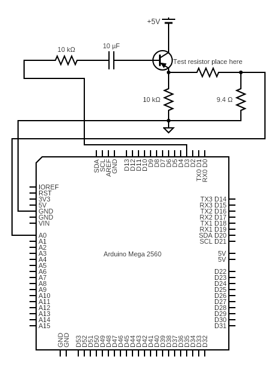
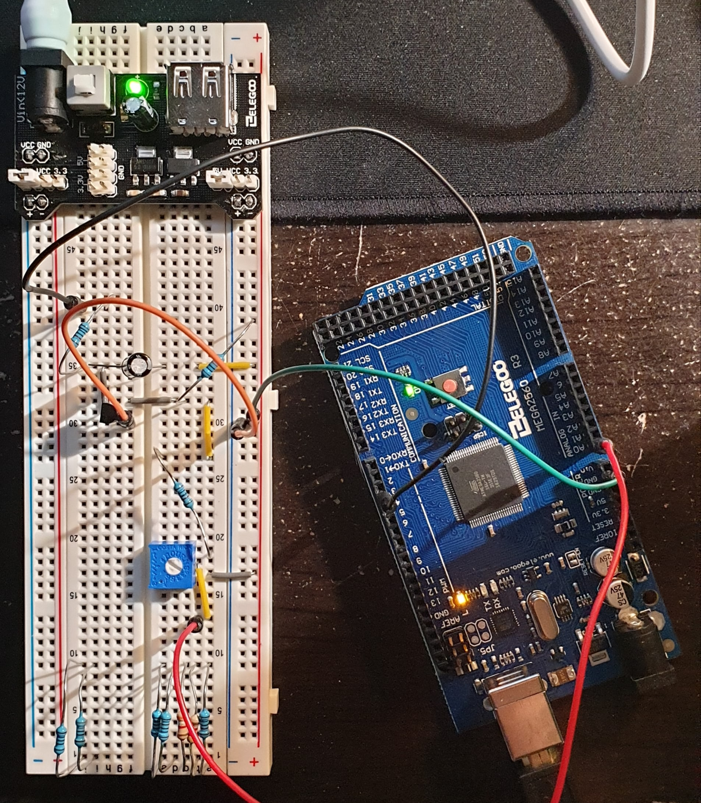
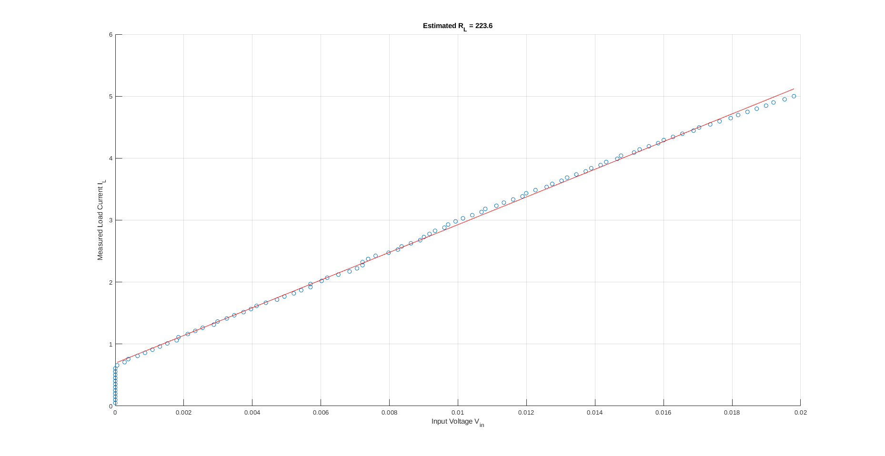
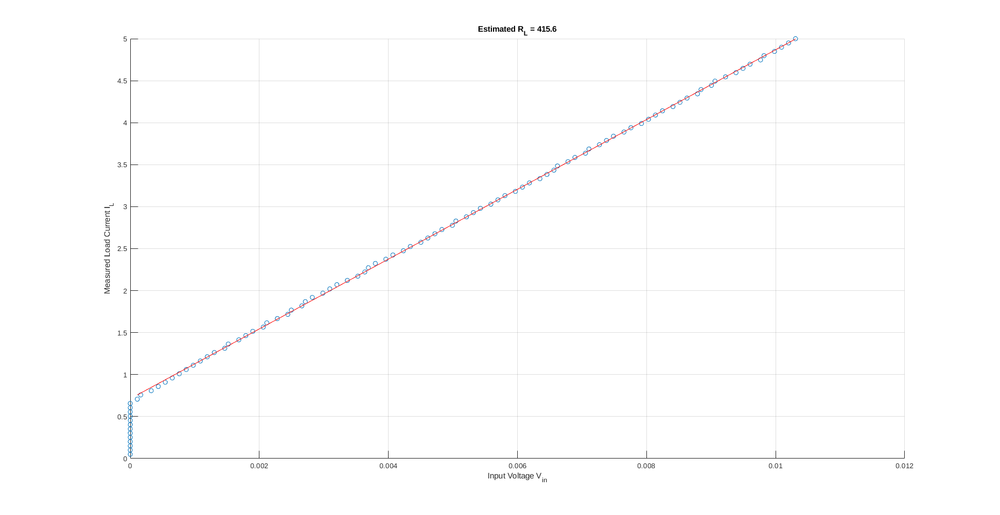
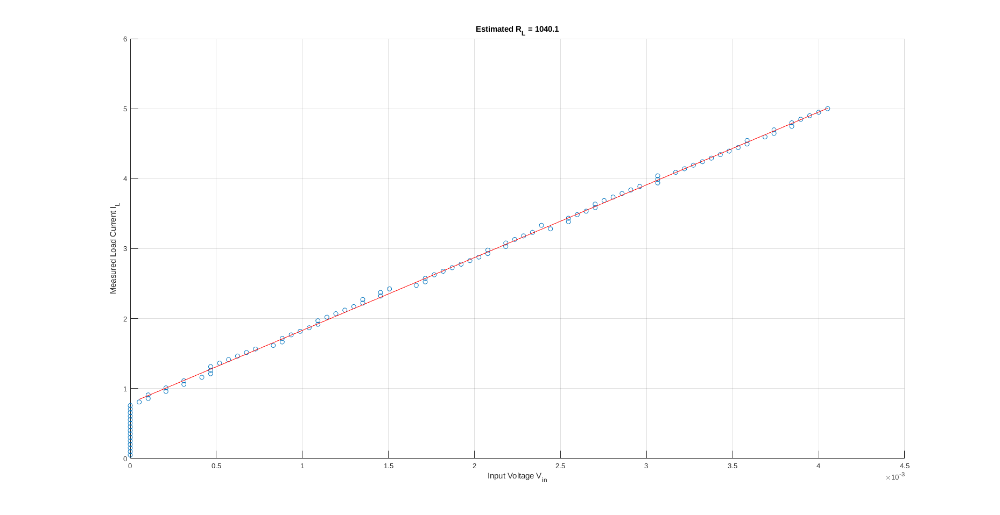
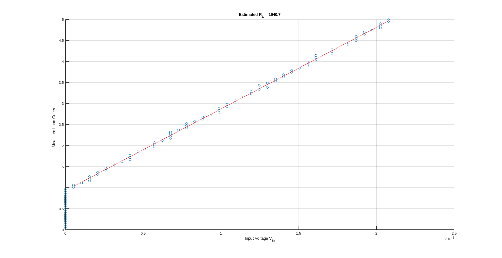
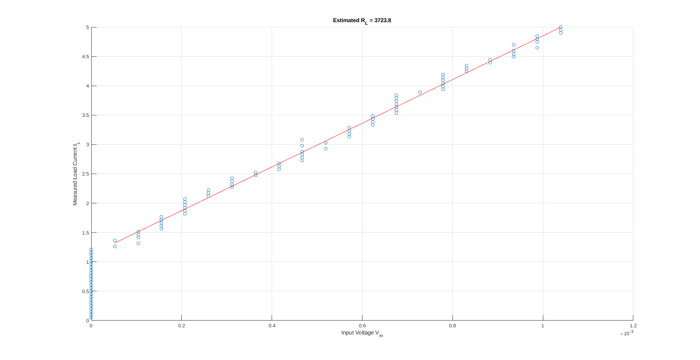
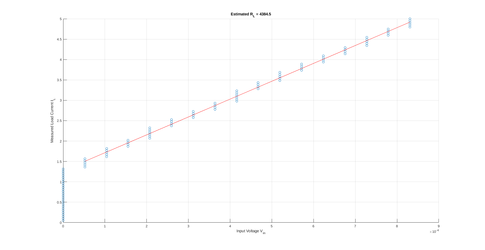
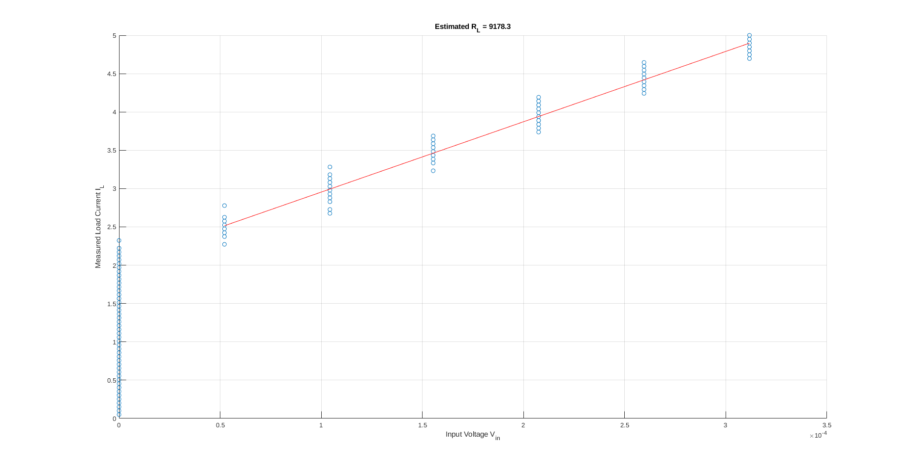

## Tai Duc Nguyen - ECE 303 - 04/10/2020

# Lab 1 Memo

1. [Lab 1 Memo](#lab-1-memo)
   1. [Experimental Setup](#experimental-setup)
      1. [Circuit Diagram](#circuit-diagram)
      2. [Constructed Circuit](#constructed-circuit)
   2. [Experimental Results](#experimental-results)

## Experimental Setup

This experiment's goal is to create a system which can measure the resistance of a resistor based on the Arduino Mega 2560. The system detailed in this memo consists of 3 main parts: 
1. PWM to DC converter
2. The testing resistor
3. Measuring device

The PWM to DC converter is built using a low pass filter and a BJT voltage amplifier with a gain of 1 and a (additional) resistance of approximately 50 $\Omega$.

The resistors in questions are: 100$\Omega$, 330$\Omega$, 1k$\Omega$, 2k$\Omega$, 3840$\Omega$, 4640$\Omega$ and 10k$\Omega$. 

The measuring device takes in voltage (analog) and quantize with 1024 steps (each step is 0.00488V). Since the current going through the resistor and the shun resistor is the same, using the quantized voltage measurement, the current can be calculated, which is used to reveal the resistor's resistance.

### Circuit Diagram

### Constructed Circuit

## Experimental Results

The results shown below indicates that this circuit is most accurate for resistors of > 1k$\Omega$ with error from 5-10% *(higher resistance correlates with higher error)*. Below 1k$\Omega$, the system has a much large error from 30-100% *(lower resistance with higher error)*.

### 100$\Omega$ ($R_L=223.6\Omega$)

### 330$\Omega$ ($R_L=415.6\Omega$)

### 1k$\Omega$ ($R_L=1040.3\Omega$)

### 2k$\Omega$ ($R_L=1940.7\Omega$)

### 3840$\Omega$ ($R_L=3723.8\Omega$)

### 4640$\Omega$ ($R_L=4384.5\Omega$)

### 10k$\Omega$ ($R_L=9178.3\Omega$)

