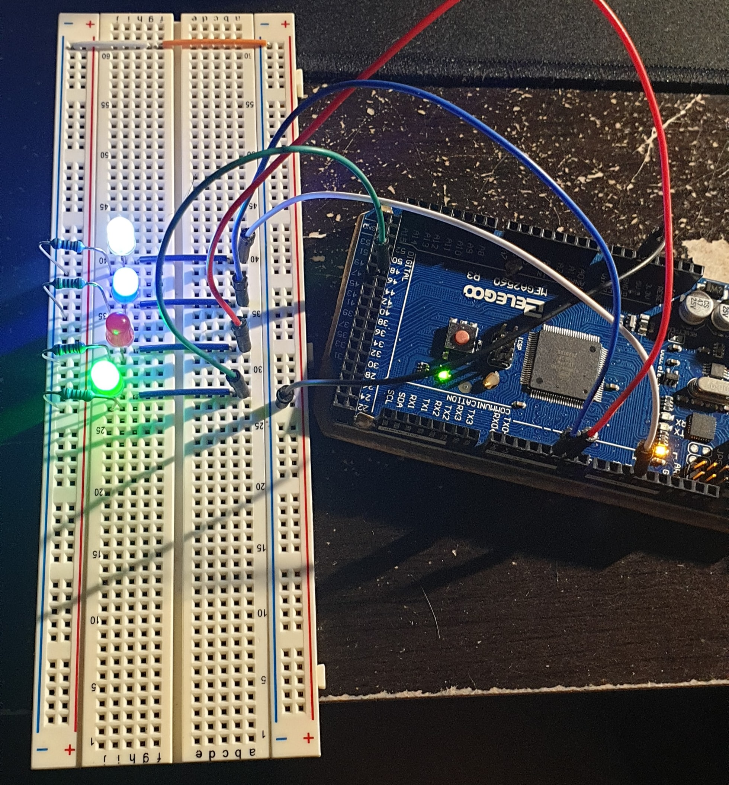

## Tai Duc Nguyen - ECE 303 - 04/18/2020

# Lab 2 Memo

1. [Lab 2 Memo](#lab-2-memo)
   1. [Experimental Setup](#experimental-setup)
      1. [Constructed Circuit](#constructed-circuit)

## Experimental Setup

This experiment features a game called Codebreaker. The participant's task is to guess a 4 digit number code in 5 tries. If the guess on a number is accurate, then the corresponding LED is turned off. Else, that LED will blink faster. In order to control the 4 LEDs, 4 (16 bit counter) interrupts and a vector, `is_start`, to turn the LEDs `OFF` are used.

The algorithm works as follow:
 - A random 4 digits number is generated (stored into an array of 4 `uint8_t` elements)
 - The vector `is_start` is initialized to all 0 (`OFF` state)
 - If user enter a 4 digit number:
   - Check each user entered digit with the corresponding randomly generated digit.
   - If match, then `is_start[i]` is set to `0`
   - if not, then `is_start[i]` is set to `1`. And, the blink rate of LED `i` is doubled: `led_hertz[i] *= 2`
   - Update `OCRiA` for all LEDs.
   - If user entered all correct digits, then exit. Print the user has won.
   - If not, increment `attempts` by 1. Check if `attempts` is 5. If so, print game over and the randomly generated number.
   - Allow the user to continue the game or finish the game. If continuing, then reinitialize all vectors and prompt the user for guesses.

### Constructed Circuit

