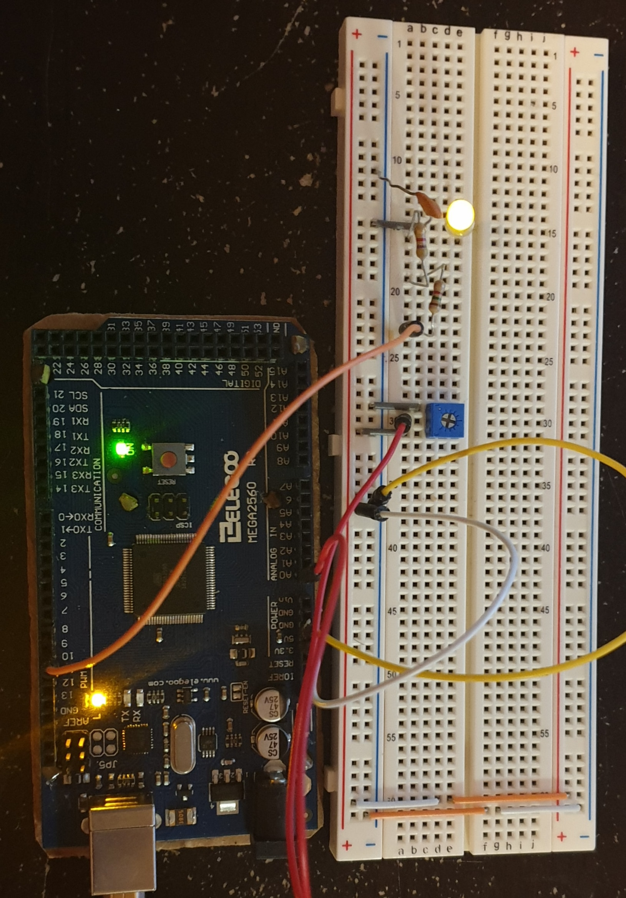

## Tai Duc Nguyen - ECE 303 - 04/18/2020

# Lab 3 Memo

1. [Lab 3 Memo](#lab-3-memo)
   1. [Lab Setup](#lab-setup)
   2. [Constructed Circuit](#constructed-circuit)

## Lab Setup

This lab setup feature the construction of a function generator using the Arduino Mega2560. The function being generated is a sine wave ranging from 0 to 5V. The frequency of the sine wave is determined by a potentiometer, or, input into the system using SCPI commands. Hence, the device being built needs to do 3 tasks:

1. Sense the voltage difference (with regards to a reference voltage) created by a potentiometer.
2. Convert the voltage readings into sine wave frequency.
3. Generate a sine wave using PWM and the calculated frequency.

The first tasks involve using the Arduino's ADC module, converting voltage readings (0-5V) into a 10-bit number. This is done using an interrupt and a timer running at ~ **9.615kHz**. This sampling rate is computed by taking the Arduino's clock freq of $16\times 10^9$ Hz, dividing by the product of a prescaler, 128, and the number of cycles for a reading to be completed, 13. The reason for the prescaler to be 128 is due to the fact that in order for the arduino to output a 10-bit reading, the ratio of $\frac{16\times 10^9}{\text{prescaler}}$ needs to be between 50 and 200 kHz.

The second task is achieved by first mapping the 10-bit reading into a particular frequency number. The mapping method is linear mapping.

The third task comprises of using the calculated frequency number to index into a sine wave table, which tells the voltage the arduino should be generating. This number is converted to the duty cycle of a PWM signal so that the desired voltage can be acquired. The output of this signal is filtered through a LPF (using a R ~ 6.5$k\Omega$ and C ~ 0.1$\mu F$), and used to control a LED. The design of this filter tries to accomplish a goal, which is attenuating anything > **8kHz (PWM rate, or, the filter's cutoff freq)** to have a power of < -33dB. However, since the filter is a very simple first-order-filter, the frequency remains in the signal will be around $f_c=250Hz$. This means the 2 values for R and C is 6336$\Omega$ and 0.1$\mu F$, respectively. The frequency of the PWM is chosen to be 8kHz because it is closest to the ADC sampling rate of 9.615kHz. Of course, this can be higher, but, since the ADC sampling rate is only 9.615kHz, a higher rate will only make the generated signal more smooth while the response to change in frequency is the same. If the PWM rate is lower than 8khz, then the generated signal will have a lower resolution.

## Constructed Circuit

