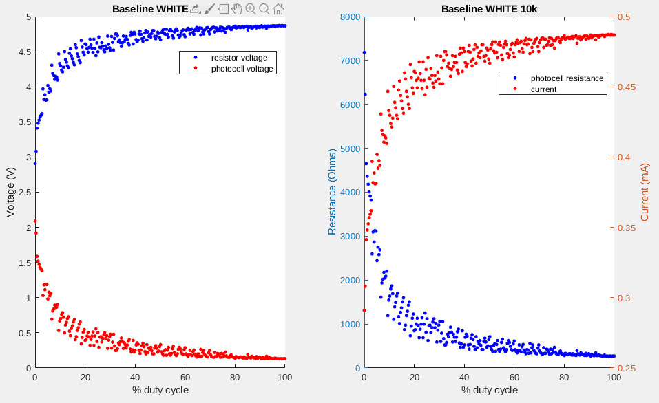
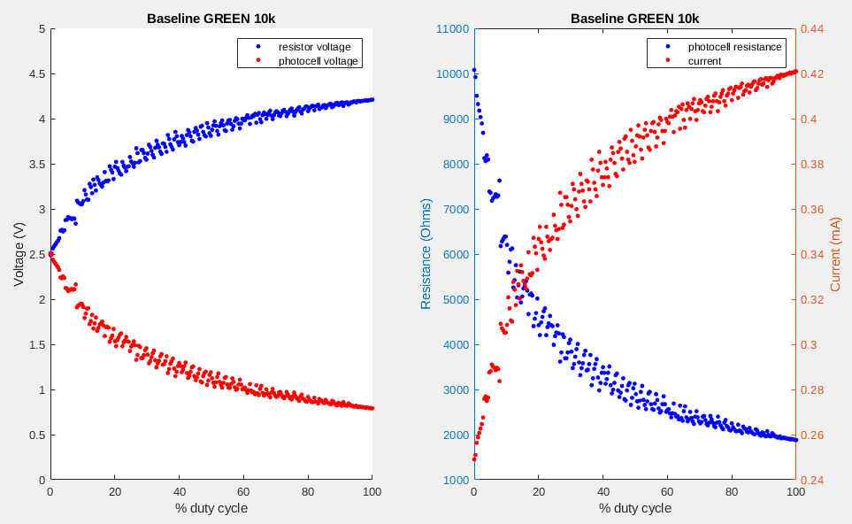
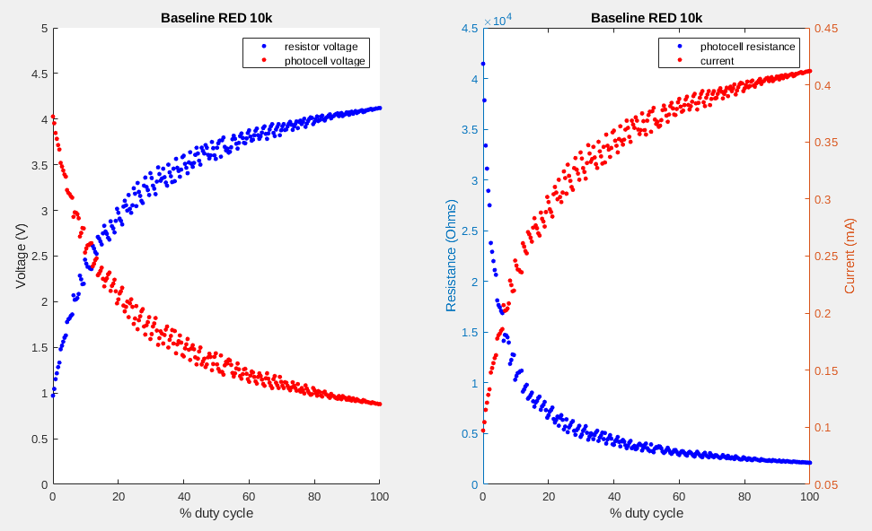
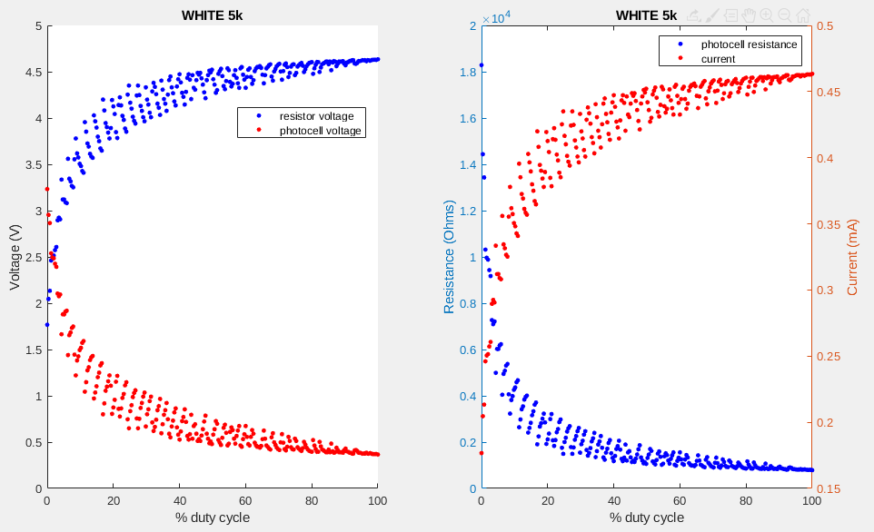
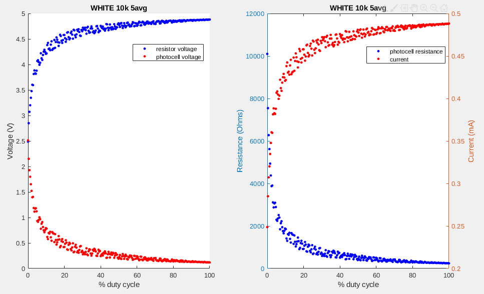

## Tai Duc Nguyen - ECE 303 - Lab 4

# Lab 4

1. [Lab 4](#lab-4)
2. [Graph Results](#graph-results)
3. [Answer to Lab Questions](#answer-to-lab-questions)

# Graph Results

# Answer to Lab Questions

1. Is it better to take voltage readings across the photocell or resistor?

It does not matter if the measurement is taken across the photocell or the resistor because the measuring prob is always in between the 2 and the only thing that changes is the reference voltage (5V or 0V).

2. Is it better to have the experiment be conducted in a totally dark room or in a container that light can’t penetrate?

It is important to have the LED ***as close as possible*** to the photoresistor because the further away the light source is, the less energy will be able to reach the sensor by a factor of the distance ***squared***. A totally dark room or a container that light can't penetrate won't have a big impact on the data collected, assuming light can't reflect off any objects in both cases.

3. Should the photocell get the same voltage readings from different color LEDs? Why or why not?

The photocell should NOT get the same voltage readings from different color LEDs because each colored light has different energy according to its wavelength and frequency.

4. Is it better to conduct averaging on the Arduino, or post-process it on a computer?

It is better to conduct averaging on the computer because averaging is a floating point operation. The Arduino may not have a floating point arithmetic unit, or it can be slow to compute.

5. Is it better to save the data in memory and then transfer the data to the computer, or send the data every sample?

It really depends on the time-criticality of the application, the memory resource on the measuring device, and the data transfer bandwidth it and a computer. With this experiment, however, there are not any differences.

6. Would it be better or worse if each iteration is conducted faster?

The delay from the time the duty cycle is "fully in effect" to the time the measurement is taken from the sensor should be reasonable so that light can travel from one to another, an the resistance on the photocell has enough time to adjust. So, fast, until a certain point, will be better since you will get more data (which you can do averaging or filtering on).