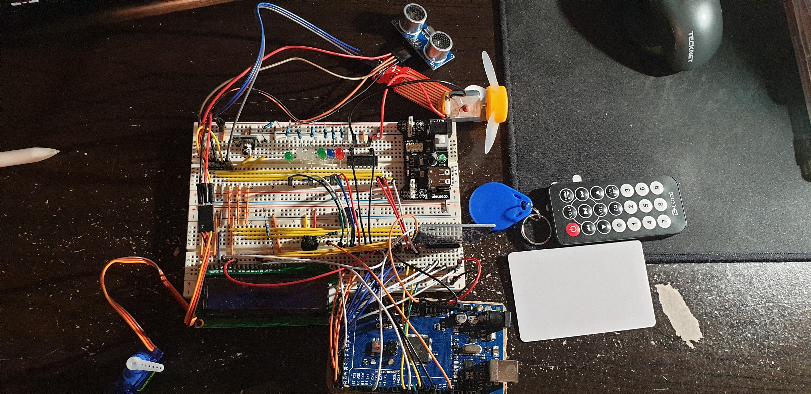

## Tai Duc Nguyen - ECE 303 - 06/08/2020

# Project

1. [Project](#project)
   1. [Photo of the setup](#photo-of-the-setup)
   2. [Video demonstration](#video-demonstration)
   3. [Current budget](#current-budget)
   4. [Data collection](#data-collection)

## Photo of the setup

## Video demonstration

https://1513041.mediaspace.kaltura.com/media/tdn47_ece303_online_project/1_rqlw4jj2

## Current budget

The power supply provides maximum of 1000mA.

The motor's maximum load is 400mA

The servo's maximum load is 270mA

The LCD's maximum load is 160mA

All other sensor's load is 150mA

Total: 400 + 270 + 160 + 150 = 980mA  < 1000mA

## Data collection

The communication protocol between the arduino and computer (MATLAB) is SCPI. There are 3 main commands:
:MEAS:ALL will send all the available stored sensors values to MATLAB

:GET:ALL will send all the available states of the system to MATLAB

:SET:ALL x,y,z will set the LEDs to state x, servo to angle y, and motor speed to z(%).

The automatic control of the servo and motor is done from MATLAB (MATLAB sends commands to control the system) in the AUTO mode. Once MANUAL priviledge is evoked, MATLAB loses all control abilities until AUTO mode is evoked again by the user or the user become unauthorized. 