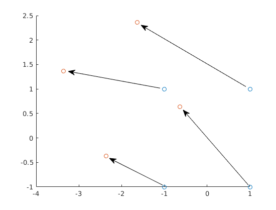
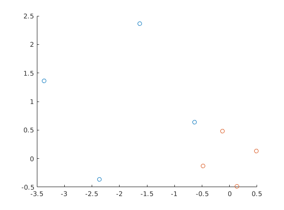
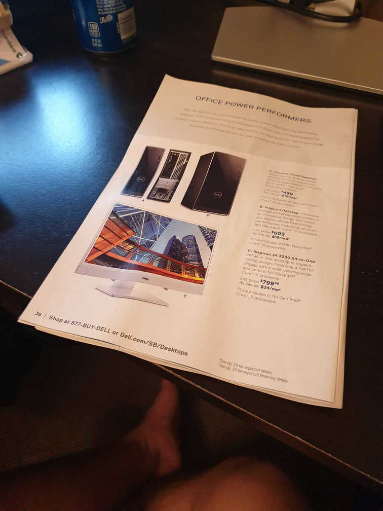
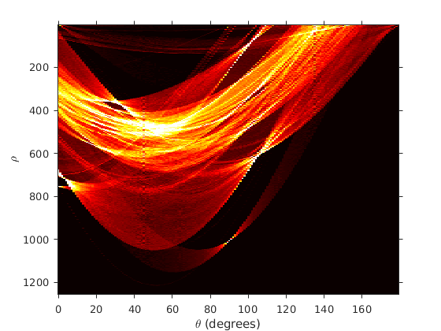
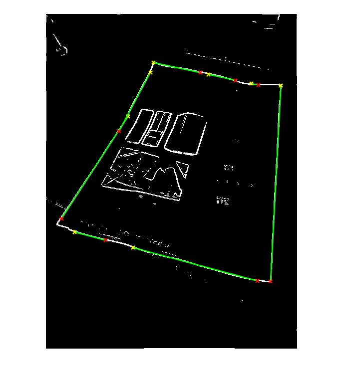
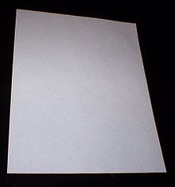
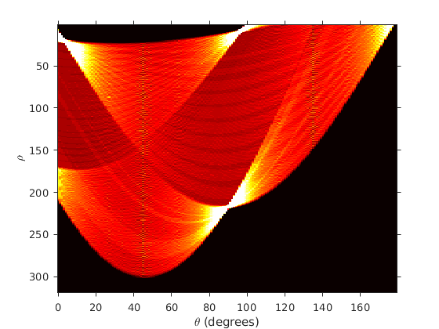
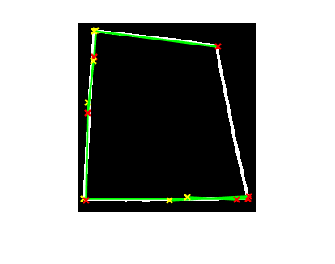
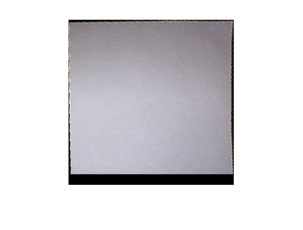

## Tai Duc Nguyen - CS 435 - HW3 - 05/28/19

- [Assignment 5 Theory](#assignment-5-theory)
  - [Q1](#q1)
  - [Q2](#q2)
  - [Q3](#q3)
  - [Q4](#q4)
  - [Q5](#q5)
- [Assignment 5 Programming](#assignment-5-programming)
  - [With test pic 1:](#with-test-pic-1)
    - [Original:](#original)
    - [Hist:](#hist)
    - [Edge:](#edge)
    - [Rectified:](#rectified)
  - [With test pic 2:](#with-test-pic-2)
    - [Original:](#original-1)
    - [Hist:](#hist-1)
    - [Edge:](#edge-1)
    - [Rectified:](#rectified-1)

# Assignment 5 Theory

## Q1
Given a rotation of 30° (clockwise) and a translation of $d_x = −2, d_y = 1$ (in that order), what is the 2D homogenous transformation matrix. 

*Answer:*

$M = 
\left[\begin{matrix} 
    1 & 0 & -2 \\
    0 & 1 & 1 \\
    0 & 0 & 1 \\
\end{matrix}\right]
\left[\begin{matrix} 
    cos(30\degree) & -sin(30\degree) & 0 \\
    sin(30\degree) & cos(30\degree) & 0 \\
    0 & 0 & 1 \\
\end{matrix}\right] = 
\left[\begin{matrix} 
    0.8660  & -0.5000  & -2.0000 \\
    0.5000  &  0.8660  &  1.0000 \\
    0       &  0  &  1.0000 \\
\end{matrix}\right]$

## Q2
Apply the transformation matrix your found in the previous part to the following pixel locations to get the new set of locations

$P = 
\left[\begin{matrix}
    -1 & 1 & 1 & -1 \\
    -1 & -1 & 1 & 1 \\
\end{matrix}\right]$

*Answer:*

$M \times P_{hom} = 
\left[\begin{matrix} 
    0.8660  & -0.5000  & -2.0000 \\
    0.5000  &  0.8660  &  1.0000 \\
    0       &  0  &  1.0000 \\
\end{matrix}\right]
\left[\begin{matrix}
    -1 & 1 & 1 & -1 \\
    -1 & -1 & 1 & 1 \\
    1 & 1 & 1 & 1 \\
\end{matrix}\right]$

$P' = 
\left[\begin{matrix}
   -2.3660  & -0.6340  & -1.6340  & -3.3660 \\
   -0.3660  &  0.6340  &  2.3660  &  1.3660 \\
\end{matrix}\right]$

## Q3
Plot/graph this before and after the transformation. Does it make sense? If you wish you may hand-draw this, take a photo of your drawing, and insert that image into your solution document

## Q4
Using your set of four point correspondences from the previous two questions, what is the planar projection matrix (i.e. the homography)? You cannot use your prior knowledge (that the image was rotated and translated to make this matrix). Instead solve for its coefficients.

$P' \propto = 
\left[\begin{matrix}
    h_{11} & h_{12} & h_{13} \\
    h_{21} & h_{22} & h_{23} \\
    h_{31} & h_{32} & h_{33} \\
\end{matrix}\right]
\left[\begin{matrix}
    x \\
    y \\
    1 \\
\end{matrix}\right]$

*Answer:*

$A_1 = \left[\begin{matrix}
    -x & -y & -1 & 0 & 0 & 0 & \hat{x}x & \hat{x}y & \hat{x} \\
    0 & 0 & 0 & -x & -y & -1 & \hat{y}x & \hat{y}y & \hat{y} \\
\end{matrix}\right]$

$A^TAh = 0$

$A$ has 8 rows (4 x,y pairs from 4 points of correspondence)

Eigenvalues of $A^TA$ is
$\left[\begin{matrix}
    7.0518 \\
    5.6118 \\
    3.6755 \\
    2.0000 \\
    2.0000 \\
    2.0000 \\
    0.8730 \\
    0.7128 \\
\end{matrix}\right]$

Hence, the smallest value is: 0.7128, corresponding to the eigenvector of:
$\left[\begin{matrix}
    0.306186217847897	\\
    0.176776695296637	\\
    -4.40499264209134e-17\\
    -0.176776695296637	\\
    0.306186217847897	\\
    -1.27316653267800e-16 \\
    -0.707106781186548	\\
    0.353553390593274	\\
    0.353553390593274   \\
\end{matrix}\right]$
is the solution for $H$

## Q5
Does your answer above make sense? Why or why not? Remember, that due to the |H| = 1
constraint, your planar projection matrix is only to scale (1pt).

*Answer:*

Since |H| is 1, we get the scaled version. The resulting homography (in red) could use some improvements but definitely makes sense. 

# Assignment 5 Programming

***The algorithm used in this programming assignment is from the following sources:***
http://fourier.eng.hmc.edu/e161/dipum/houghpeaks.m
https://opencv-python-tutroals.readthedocs.io/en/latest/py_tutorials/py_imgproc/py_houghlines/py_houghlines.html
***

The properties tuned for this assignment are:

threshold = 4

numpeaks = 7

nHoodSize = floor(size(hough_matrix) / 100.0) * 2 + 1; (use for suppression so you don't get dozens of little peaks close to one-another)

MinLength = 20 (minimum distance between 2 points on a line)

My algorithm to choose the 4 corner points is *not optimal*. I technically choose the points with min(x), max(x), min(y), max(y). This won't work for every image. The second test pic needs 1 manual point.

## With test pic 1:

### Original:

### Hist:

### Edge:

### Rectified:

## With test pic 2:

### Original:

### Hist:

### Edge:

### Rectified:

