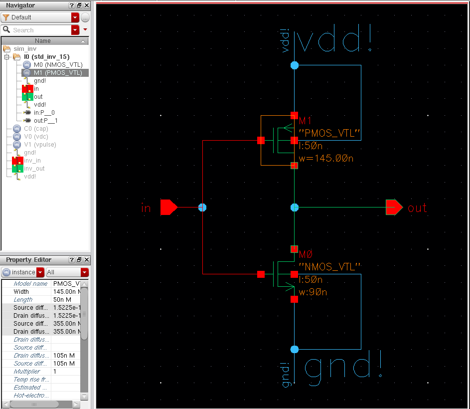
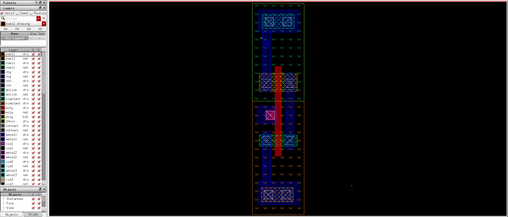
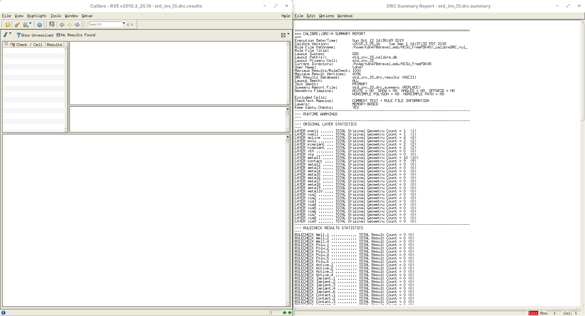
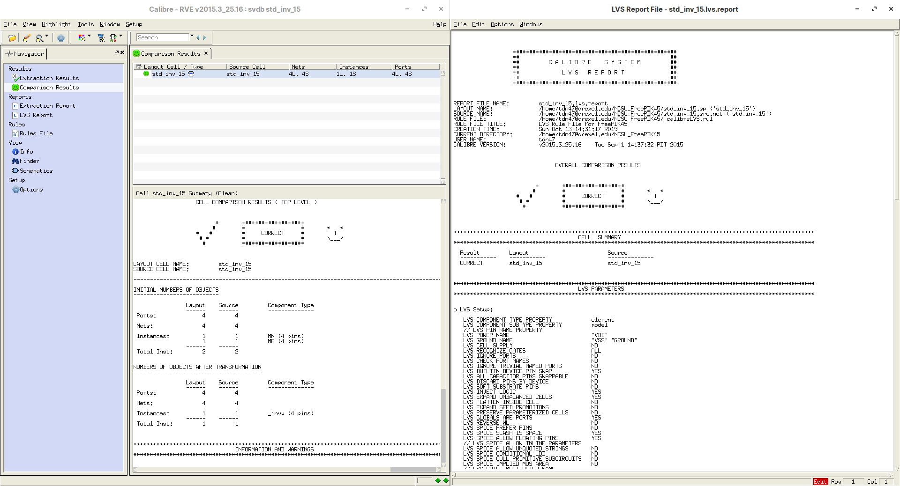
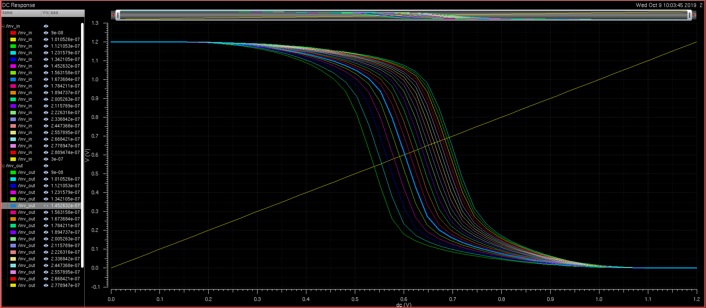
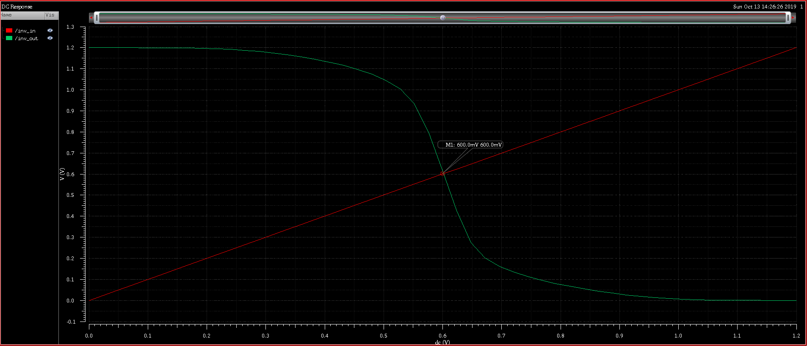
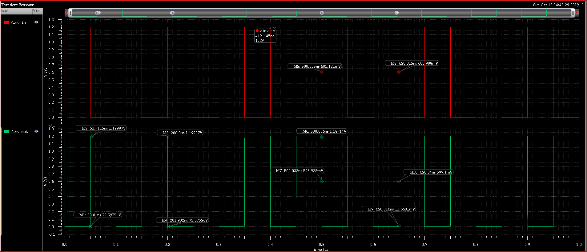
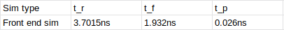

## Tai Duc Nguyen - ECEC471 - 10/03/2019

# Content
- [Content](#content)
- [Lab 1 Results](#lab-1-results)
  - [Schematic View](#schematic-view)
  - [Layout View](#layout-view)
  - [Layout DRC verification results](#layout-drc-verification-results)
  - [Layout LVS verification results](#layout-lvs-verification-results)
  - [DC sweep simulation plot](#dc-sweep-simulation-plot)
  - [Chosen PMOS channel width](#chosen-pmos-channel-width)
  - [Final DC simulation for chosen PMOS channel width](#final-dc-simulation-for-chosen-pmos-channel-width)
  - [Final transient simulation result](#final-transient-simulation-result)
  - [Timing information extracted from transient simulation](#timing-information-extracted-from-transient-simulation)

# Lab 1 Results

## Schematic View

## Layout View

## Layout DRC verification results

## Layout LVS verification results

## DC sweep simulation plot

## Chosen PMOS channel width
Sweeping from 90nm -> 300nm (step = 10nm), The chosen PMOS channel width is 145nm (shown in [Schematic View](#schematic-view))

## Final DC simulation for chosen PMOS channel width

## Final transient simulation result

## Timing information extracted from transient simulation

Assuming the rise and fall times are usually measured between the 0% and 100% levels:

$$t_r = 53.7115 - 50.01 = 3.7015ns$$

$$t_f = 201.932 - 200.00 = 1.932ns$$

$$t_{pdf} = 500.032 - 500.005 = 0.027ns$$

$$t_{pdr} = 650.04 - 650.015 = 0.025ns$$

$$t_p = (t_{pdf} + t_{pdr})/2 = 0.026ns$$

