---
output:
  html_document:
    df_print: paged
  pdf_document: default
  word_document: default
---
```{r global_options, include=FALSE}
knitr::opts_chunk$set(fig.pos = 'h')
```
## Tai Duc Nguyen - ECEC471 - 10/20/2019

## Lab Report Week 3
## CMOS NOR & NAND

## Content
- [Objective](#objective)
- [Introduction](#introduction)
  - [Gate sizing](#gate-sizing)
  - [Rise time and Fall time](#rise-time-and-fall-time)
  - [Propagation delay](#propagation-delay)
  - [Symmetric gates](#symmetric-gates)
- [Simulation process and results](#simulation-process-and-results)
  - [Schematic design](#schematic-design)
  - [Layout design of symmetric inverter](#layout-design-of-symmetric-inverter)
  - [Physical verification](#physical-verification)
- [Analysis of simulation results](#analysis-of-simulation-results)
- [Conclusion](#conclusion)

# Objective
The objective for this laboratory is to design, simulate and verify the schematic and layout of a 2 input CMOS NOR & a 2 input CMOS NAND gate using Cadence Virtuoso. The process includes:
1. Creating the schematic with known sized PMOS & NMOS
2. Obtain a symmetric version of each gate with the ADE(L) simulation coupled with parametric analysis.
3. With the sizing decided for the NMOS & PMOS, the layout of each gate is built and checked against DRC and VLS verificaton tool.

# Introduction
NOR gate and NAND gate are `Universal` gates, which means that they are the building block of many, if not most, advanced electronics. Both gates require a pull up network consisting of 2 PMOS and a pull down network consisting of 2 NMOS. In a NOR gate, the 2 PMOS are connected in series and the 2 NMOS are connected in parallel. In a NAND gate, however, the reverse happens, where the PMOSes are in parallel and the NMOSes are in series.

## Gate sizing
The sizing of the PMOS and NMOS components in each gate have great impact to the performance of the gates. Hence, it is important to make both gate symmetric (equal rise time and fall time) to create a reponsive device. 

## Rise time and Fall time
The Rise time (denoted as $t_r$) is the time required for the output signal voltage to rise from 10% to 90%.

The Fall time (noted as $t_f$) is the time required for the output signal voltage to fall from 90% to 10%.

## Propagation delay
Propagation delay (denoted as $t_{pd}$) is the time from the moment the input voltage reaches 50% to the time the output voltage also reaches 50%.

## Symmetric gates
A gate is considered symmetric if and only if $t_r = t_f$. Hence, both the low to high and high to low transition will meet at $\frac{1}{2}$ VDD. In order to obtain this symmetricity, the sizing of the width of the NMOS and PMOS components can be adjusted.

# Simulation process and results

## Schematic design
The following figure (1a & 1b) show the initial set up for the schematic of the NOR gate (1a) and NAND gate (1b). All the lengths are 50nm and widths are 90nm.


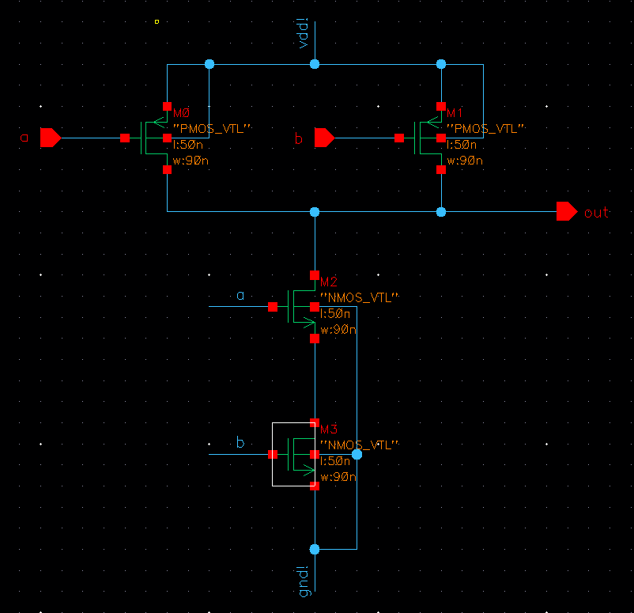

To simulate the transient and DC behavior of each gate, a 5fF capacitive load and a voltage source (Amplitude=1.2V, delay=0, rise time=5ps, fall time=5ps, time period (input a)=2ns, time period (input b)=4ns, pulse width (input a)=1ns, pulse_width (input b)=2ns). The top level schematic for NOR gate (Figure 2a) and NAND gate (Figure 2b) is shown below:

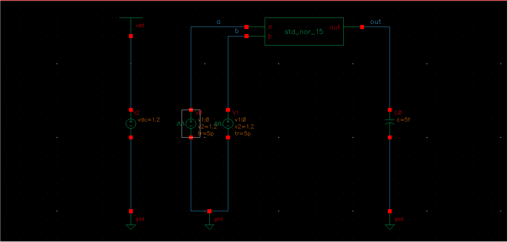

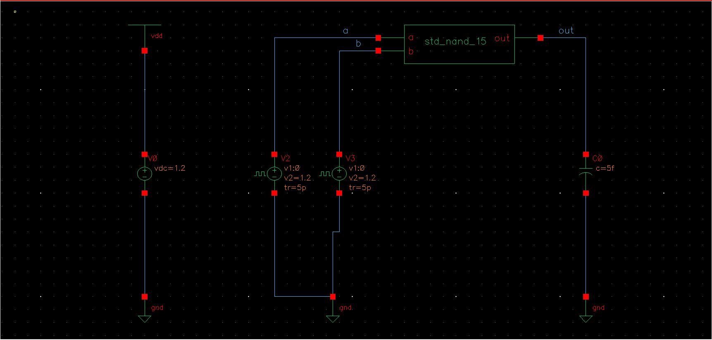

Hence, the transient behavior of each gate (Figure 3a, 3b) and the DC behaviors (Figure 4a, 4b) can be recorded and shown:
  
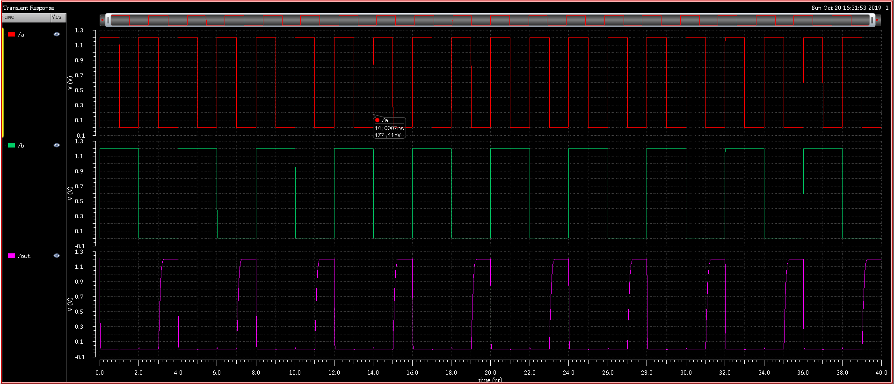

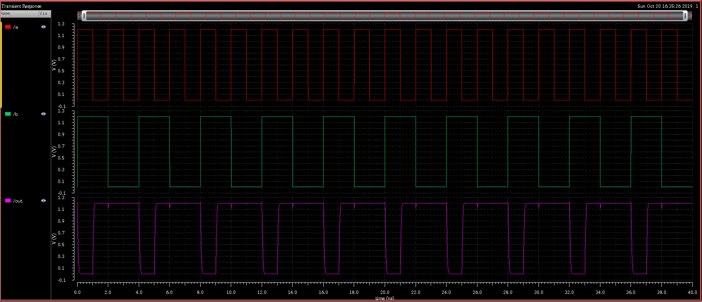

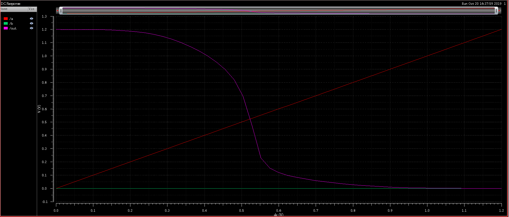


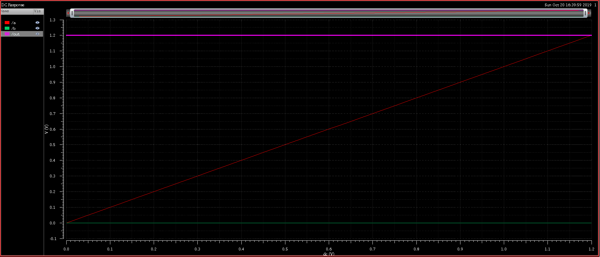

From these simulations, it is apparent that both the initial sizing does not lead to a symmetric device -- the switching potential is not at $\frac{1}{2}$ VDD (0.6V). The DC plot for the NOR gate shows that the switching potential is < 0.6V, which means that the width of the PMOS needs to be increase. However, the DC plot for the NAND gate indicates that there is no switching potential, which means that the width of the NMOS is too small.

To do the parametric analyses for both gates, it is important to consider the worse-case scenario with regards to the propagation delay. For the NOR gate, there are 2 combination of input signals that will induce a change in the output signal -- when b=0 and a transition from 1->0; and when both a & b transition from 0->1. Measuring the propagation delay and choose the combination with the longest $t_{pd}$ (Figure 5a). This combination will allow the alteration of the top level schematic and the work on the parametric analysis. 

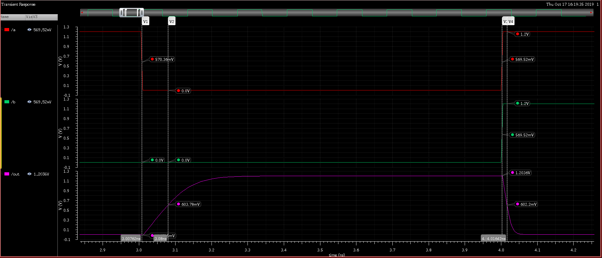

From Figure 5a, it is clear that the combination of `when b=0 and a transition from 1->0` will produce the longest $t_{pd}$. 
$$t_{a=1->0,b=0} = 3.08000-3.00762 = 0.07238 ns$$
$$t_{a=0->1,b=0->1} = 4.01642-4.00300 = 0.01342 ns$$

Therefore, the modified top level schematic is:

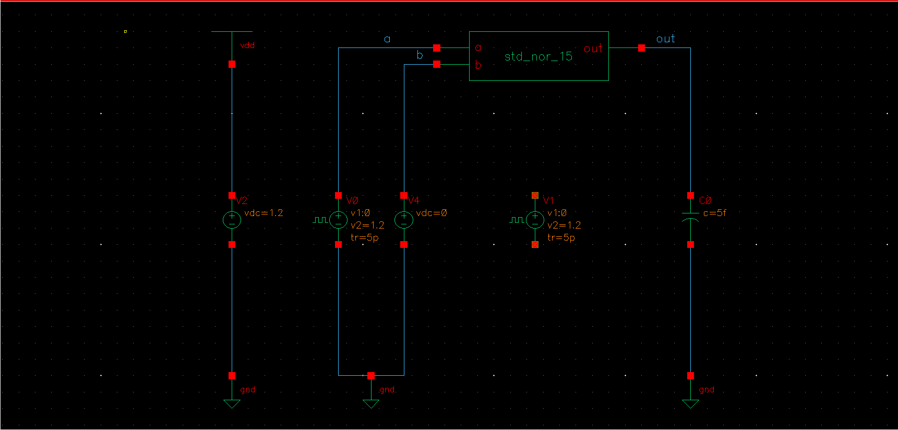

Similarly, the NAND gate's worse-case scenario $t_{pd}$ analysis is conducted and it's concluded that the combination of `both inputs going from 0->1` will produce the longest propagation delay (Figure 5c).
$$t_{a=1->0,b=1} = 9.049224-9.007371 = 0.041853 ns$$
$$t_{a=0->1,b=0->1} = 12.05000-12.00248 = 0.04752 ns$$

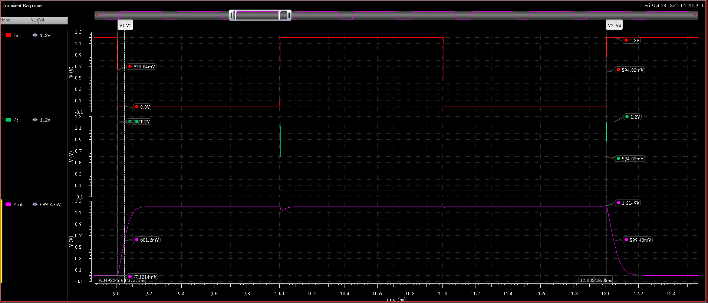

Therefore, the modified top level schematic is:

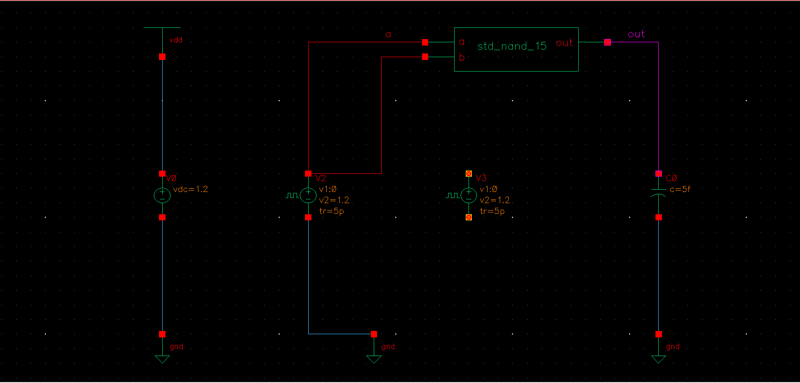

With regards to the NOR gate, a parametric analysis is conducted (Figure 6a), performing the DC plot on different values of the PMOS's widths, from 90nm to 300nm. The result is that: when the PMOS's width is at approximately 156nm, then the switching potential is 0.6V. Due to software constraint (Rule Grid.1-6), the chosen PMOS width is 155nm.

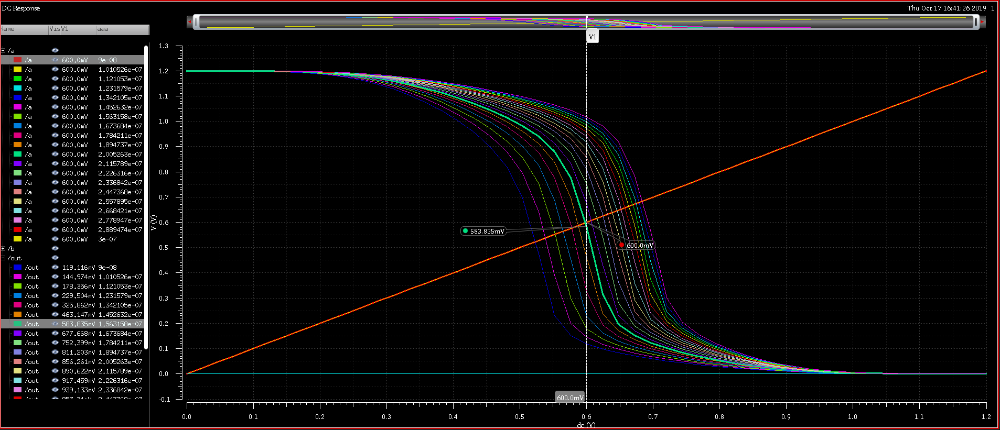

The parametric analysis for the NAND gate cannot be conducted if the NMOS width is not increased since there won't be any PMOS width (> 145nm) that produce the switching potential of 0.6V. Therefore, the PMOS width is chosen to be 145nm -- from that of an inverter to create the same drive and the parametric analyis will be ran from 145nm to 400nm for the width of the NMOS (Figure 6b).


After the parametric analysis is conducted and resulting widths for the NMOS and PMOS components of each gate are decided, the final schematics of the NOR and NAND gate are (Figure 7a, 7b):

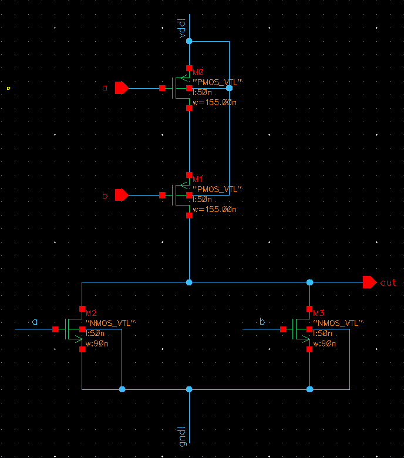

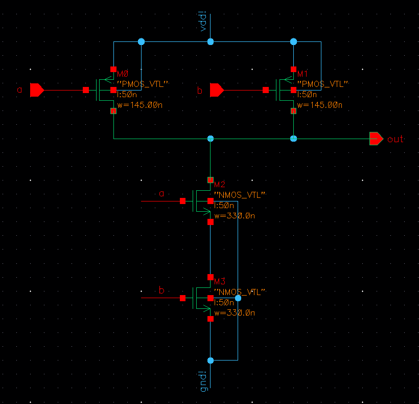

Finally, the design can be concluded with an analysis of the rise/fall time of both devices (Figure 8a, 8b):
$$t_{r NOR} = 13.09148-13.01852 = 0.07296$$
$$t_{f NOR} = 14.07627-14.00903 = 0.06724$$
$$t_{r NAND} = 19.03837-19.01227 = 0.0261$$
$$t_{f NAND} = 20.03327-20.00712 = 0.02615$$
It is apparent that $t_{r NOR} \neq t_{f NOR}$, this is because of the design constraint of the software. It is not possible to have a width of 156.31nm; 155nm is chosen instead.


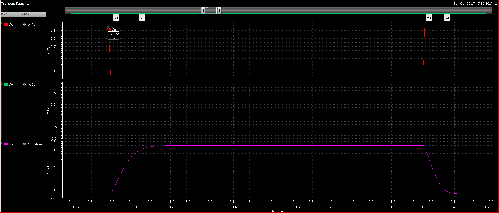

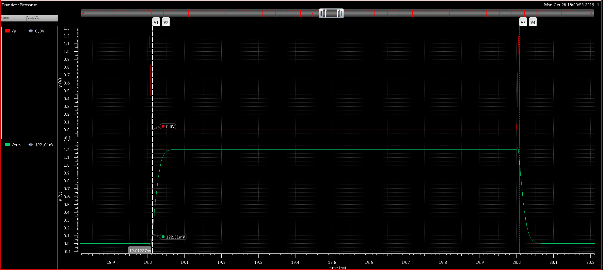

## Layout designs of symmetric NOR and NAND gates

The schematic of the symmetric NOR and NAND gates is finalized in the previous section. The physical layouts of the gates are created with the software: Virtuoso Layout Suite L.

Using stick diagrams for the 2 gates:

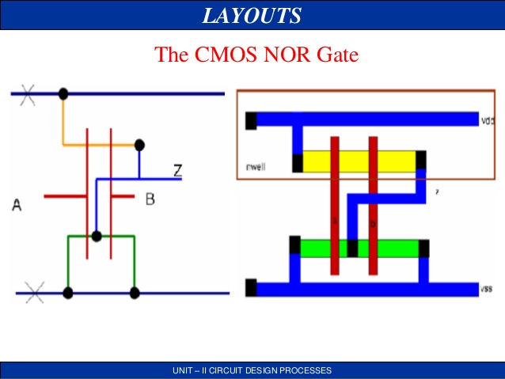

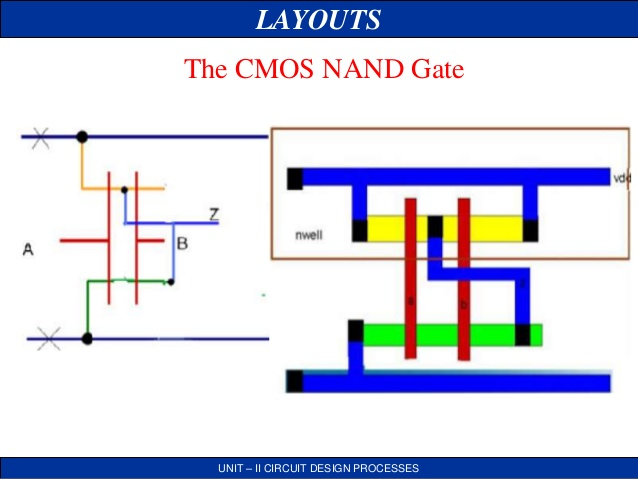

The layouts in Virtuoso Layout Suite L can be created as shown in Figure 9a, 9b:

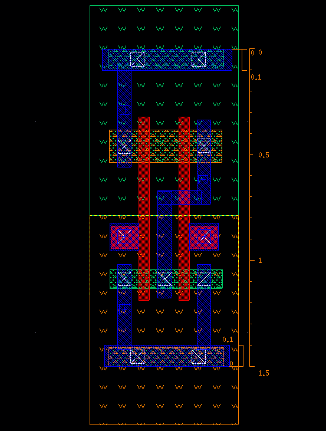

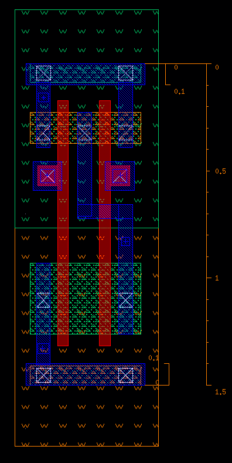

## Physical verification
The physical verification of the 2 layouts are performed using DRC and LVS. The DRC (Figure 10a, 11a) verifies the layout meets all Rules listed in the FreePDK45 process design kit (available at https://www.eda.ncsu.edu/wiki/FreePDK45:Contents). The LVS (Figure 10b, 11b) verifies that the layout matches the schematics designs shown above.

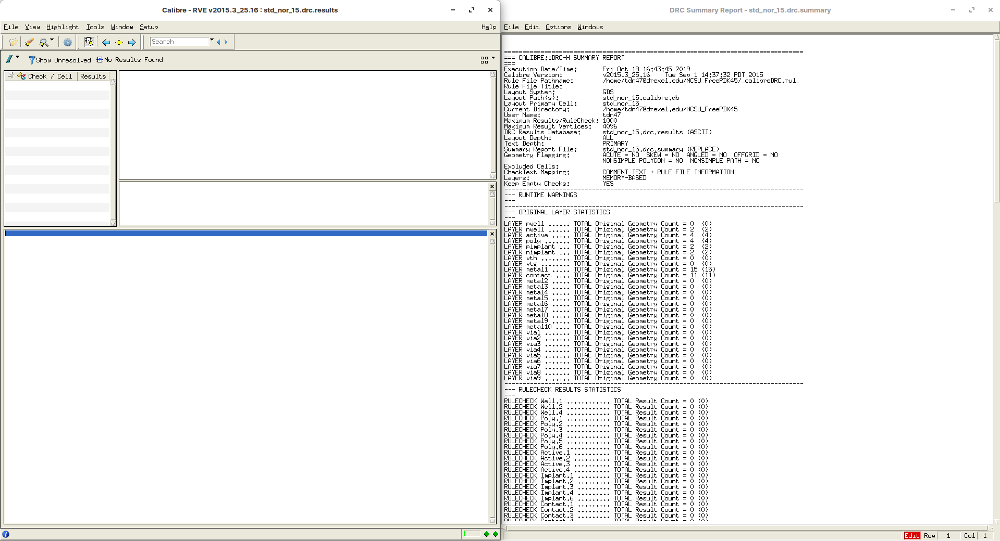

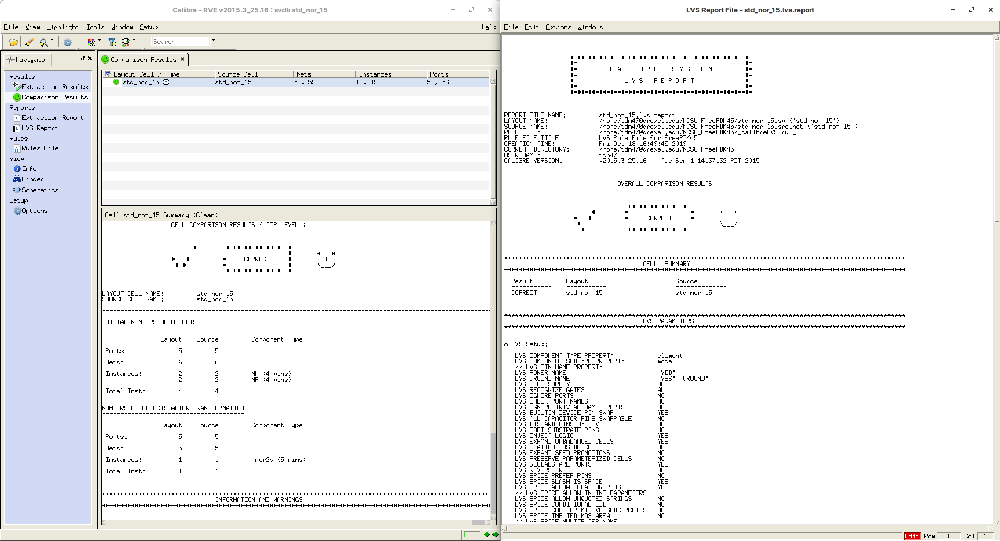

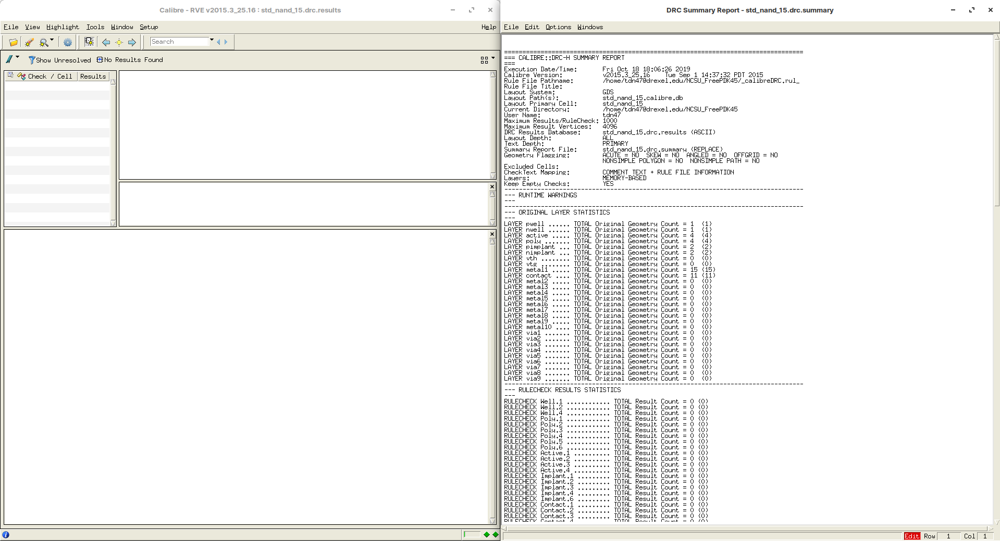

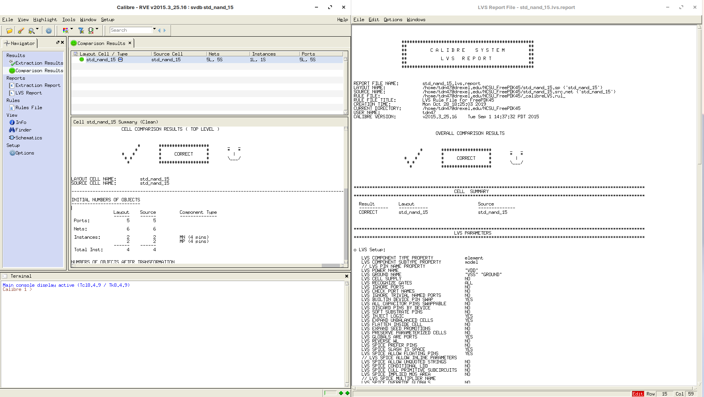


# Analysis of simulation results:

## Propagation delay
In the top level schematic of both gates, the input `vpulse` have a delay of 0ns, however, in the transient plot, the output does have a delays. The worse ones are recorded above:
$$t_{pd NOR} = 0.07238$$
$$t_{pd NAND} = 0.04752$$

## Rise time and Fall time

$$t_{r NOR} = 13.09148-13.01852 = 0.07296$$
$$t_{f NOR} = 14.07627-14.00903 = 0.06724$$
$$t_{r NAND} = 19.03837-19.01227 = 0.0261$$
$$t_{f NAND} = 20.03327-20.00712 = 0.02615$$

The rise time and fall time for the NAND gate does not equal `exactly` because the level of voltage captured at these measurements are different (due to the difficulty in obtaining `exact` measurement in the software used), but they are very close and could be considered as `equal`. However, as stated above, the rise time and fall time for the NOR gate are different due to the fact that the software cannot handle an input of 156nm (a restriction of the Rule.Grid.1-6 of the FreePDK45 processing design kit). Hence, a input of 155nm is used, which result in a difference shown above.

# Conclusion
The CMOS NOR and NAND gate's circuits and layouts are designed, analyzed and verified in this laboratory. The designing steps involves creating the initial schematics, analyzing worse-case propagation delay through the transient behavior plot, obtaining parametric analysis through the DC plot, select a sizing configuration of the PMOS and NMOS components so as to give symmetric devices, creating the layout and verify such physical layout with DRC and LVS. Finally, the rise time and fall time are observed and recorded as a metric to the performance of both devices.

