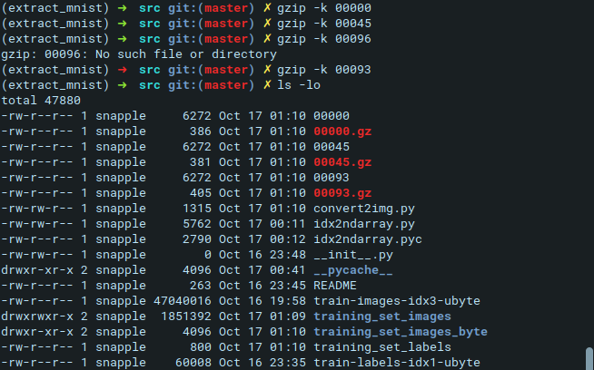

## Tai Duc Nguyen - ECEC 487 - 10/15/2019

- [Written Questions](#written-questions)
  - [1. LeCun, Yann, Bengio, Yoshua, Hinton and Geoffrey (2015). "Deep learning"](#1-lecun-yann-bengio-yoshua-hinton-and-geoffrey-2015-%22deep-learning%22)
    - [a. What is the difference between a neural network and a convolutional network?](#a-what-is-the-difference-between-a-neural-network-and-a-convolutional-network)
    - [b. What is the difference between a feed-forward network and backpropagation?](#b-what-is-the-difference-between-a-feed-forward-network-and-backpropagation)
    - [c. What is the key characteristic of recurrent neural networks, and what is the main challenge with using them? (trying this as an undergrad)](#c-what-is-the-key-characteristic-of-recurrent-neural-networks-and-what-is-the-main-challenge-with-using-them-trying-this-as-an-undergrad)
  - [2. Cilibrasi, R., Vitanyi and P. M. B. (2005). "Clustering by compression"](#2-cilibrasi-r-vitanyi-and-p-m-b-2005-%22clustering-by-compression%22)
    - [a. What are the characteristics of a `normal` compressor and how do these relate to the notion of a metric distance?](#a-what-are-the-characteristics-of-a-normal-compressor-and-how-do-these-relate-to-the-notion-of-a-metric-distance)
    - [b. Why is the specific choice of compression algorithm important in the NCD? (trying this as an undergrad)](#b-why-is-the-specific-choice-of-compression-algorithm-important-in-the-ncd-trying-this-as-an-undergrad)
    - [c. Why is the NCD robust to variations in different compression algorithms? (trying this as an undergrad)](#c-why-is-the-ncd-robust-to-variations-in-different-compression-algorithms-trying-this-as-an-undergrad)
    - [d. Extract 3 different digits and compress them using any compression algorithm of your choice. Report the compressed and uncompressed size of each digit in bytes.](#d-extract-3-different-digits-and-compress-them-using-any-compression-algorithm-of-your-choice-report-the-compressed-and-uncompressed-size-of-each-digit-in-bytes)
  
# Written Questions

## 1. LeCun, Yann, Bengio, Yoshua, Hinton and Geoffrey (2015). "Deep learning"

### a. What is the difference between a neural network and a convolutional network?

A Convolutional (Neural) Network is a type of learning network that is a subset of (Artificial) Neural Networks. An ANN does not need to have any convolutional layer, however, a CNN needs to have at least 1 convolutional layer (multiple layers forming a convolutional network).

### b. What is the difference between a feed-forward network and backpropagation?

A feedforward neural network tries to map a fixed-size input to a fixed-size output by going from layers to layers of neurons, with the next layer's neurons equal the weighted sum of the previous layer's neurons' outputs which are passed through a nonlinear function (i.e. ReLU). The information only flows "forward" in this architecture.

The backpropagation architecture introduces a "feedback" to the entire network on how it is doing on minimizing the error at the output. The error computed at the output layer is "propagated" back all the way to the input layer. Where the error is propagated through, each synapse's weights are recomputed.

### c. What is the key characteristic of recurrent neural networks, and what is the main challenge with using them? (trying this as an undergrad)

A Recurrent Neural Network tries to predict the output using inference from the pattern it sees in the input's history. To do this, it processes the input sequence one element at a time. Hence, if one dominant feature shows up over and over and over again, the backpropagated gradients may explode, or shrink to vanish otherwise. However, it is possible to maintain a stable system (reduce the variance) with advanced mathematic models.

## 2. Cilibrasi, R., Vitanyi and P. M. B. (2005). "Clustering by compression"

### a. What are the characteristics of a `normal` compressor and how do these relate to the notion of a metric distance?

A normal compressor has 4 characteristics: **Idempotency, Monotonicity, Symmetry and Distributivity**. 
Using these characteristics, it is possible to proven that a compressor `C`, which approximates the `information distance` $E(x,y)$ based on the Kolmogorov complexity, can produce a `compressor distance` $E_c(x,y)$. This distance measurement can be shown to `satisfy the metric (in)equalities up to logarithmic additive precision`, hence, a normalizing term of $E_c(x,y)$, $E_c^+(x,y)$ can be deduced.
Therefore, the NCD (normalized compression distance) is:
$$NCD(x,y) = \frac{C(xy) - min\{C(x),C(y)\}}{max\{C(x),C(y)\}}$$

From this equation, it is proven in the paper that $NCD(x,y)$ is a metric distance $d(x,y)$ because it satisfies all 4 of the following conditions
1. $NCD(x,y) \geq 0$
2. $NCD(x,y) = 0 \leftrightarrow x = y$
3. $NCD(x,y) = d(y,x)$
4. $NCD(x,y) \leq NCD(x,z) + NCD(z,y)$

### b. Why is the specific choice of compression algorithm important in the NCD? (trying this as an undergrad)
Different compression algorithms produces different NCD, hence, different approximatons of the true NID. This is due to the fact that some algorithms do not obey the 4 axioms of **Idempotency, Monotonicity, Symmetry and Distributivity** when it is using information from another file to compress the given file (and vice versa).

### c. Why is the NCD robust to variations in different compression algorithms? (trying this as an undergrad)
The NCD is a metric distance that minorizes all other feature-based similarity metrics (these features must be rather `simple` and can be `expressed` under some method that a compressor uses to analyze). Therefore, NCD can captures most (if not all) dominant features that characterize the data. Hence, whenever a compressor follow the architecture of a `normal compressor` (which gives rise to NCD), then it can be used for clustering. Another reason for the robustness of NCD is that: the algorithm does not depend on the type of the input, how the input was constructed or the underlining features inside the input. 

### d. Extract 3 different digits and compress them using any compression algorithm of your choice. Report the compressed and uncompressed size of each digit in bytes.
After Extracting 3 different digits (5, 9, 6) into byte format:
  , they have the following (uncompressed & compressed -- with `gzip`) file size:

1. Digit 5 Uncompressed: 6272 B // Compressed: 386 B
2. Digit 9 Uncompressed: 6272 B // Compressed: 381 B
3. Digit 6 Uncompressed: 6272 B // Compressed: 405 B

Screenshot of terminal

