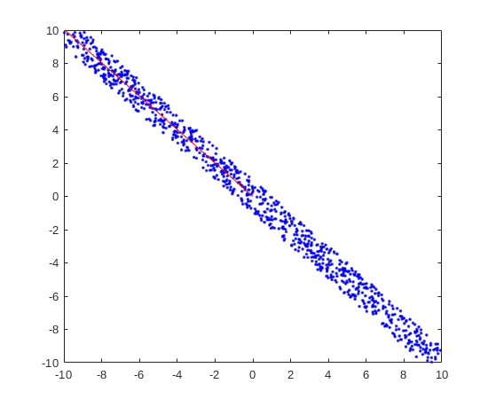

## Tai Duc Nguyen - ECEC 487 - 11/10/2019

## Homework 7

- [Programming Assignment](#programming-assignment)
  - [Problem 6.1 Textbook page 401-402](#problem-61-textbook-page-401-402)
  - [Using generating points around (l-1) dimenstional hyperplane procedures in textbook page 399](#using-generating-points-around-l-1-dimenstional-hyperplane-procedures-in-textbook-page-399)
  - [Conclusion](#conclusion)
- [Written Assignment](#written-assignment)
  - [How are MDL, the Bayesian information criterion (BIC) , and the AIC similar? How are they different?](#how-are-mdl-the-bayesian-information-criterion-bic--and-the-aic-similar-how-are-they-different)
    - [Regarding MDL, the definition is:](#regarding-mdl-the-definition-is)
    - [Regarding BIC, the definition is:](#regarding-bic-the-definition-is)
    - [Regarding AIC, the definition is:](#regarding-aic-the-definition-is)
  - [How would you construct an MDL solution for problem 6.1 above?](#how-would-you-construct-an-mdl-solution-for-problem-61-above)
  - [What is the biggest challenge in applying MDL?](#what-is-the-biggest-challenge-in-applying-mdl)

# Programming Assignment

```
clear all; close all;
rng(0);
```

## Problem 6.1 Textbook page 401-402
```
l = 2;
N = 1000;
a = 10; e = 1;

w = [1 1];
w0 = 0;
X = generate_hyper(w',w0, a, e, N);

[coeffs, score, latent] = pca(X');

pc1 = [0 0; coeffs(:,1)'*1000];

hold on
plot(pc1(:,1), pc1(:,2), 'r');
```

```
coeffs =

   -0.7054    0.7088
    0.7088    0.7054

variances =

   64.3294
    0.1624
```



## Using generating points around (l-1) dimenstional hyperplane procedures in textbook page 399
```
function X = generate_hyper(w,w0,a,e,N)
    l=length(w);
    t=(rand(l-1,N)-.5)*2*a;
    t_last=-(w(1:l-1)/w(l))'*t + 2*e*(rand(1,N)-.5)-(w0/w(l));
    X=[t; t_last];
    %Plots for the 2d and 3d case
    if(l==2)
        figure(1), plot(X(1,:),X(2,:),'.b')
    elseif(l==3)
        figure(1), plot3(X(1,:),X(2,:),X(3,:),'.b')
    end
    figure(1)
    xlim([-a a]); ylim([-a a]);
end
```

## Conclusion
From the results and the graph above, it is concluded that PC1 is the line (red) that goes through the data set, hence it is perpendicular to $h$: $[1, 1]^Tx + 0 = 0$.

# Written Assignment
*Chapter 1 of “A Tutorial Introduction to the Minimum Description Length Principle”*


## How are MDL, the Bayesian information criterion (BIC) , and the AIC similar? How are they different?
Starting with the formal definition of the 3 different methods:

### Regarding MDL, the definition is:

Given a set of data $D$ and a model $H$, the stochastic complexity of D given H is:

$\bar{L}(D|H) =  L(D|\hat{H}) + COMP(\mathcal{H})$

where $L(D|\hat{H})$ is the minimum code length when using $H$ to code $D$ and $COMP(\mathcal{H})$ is the parametric complexity of a set of point hypothesis $\mathcal{H}$.

### Regarding BIC, the definition is:

$BIC = ln(n)k - 2ln(\hat{L})$

where $n$ is the number of data points (observations), $k$ is the number of parameters in the model, and $\hat{L}$ is the maximized value of the likelihood function (or in another word, the model's accuracy when tested on unseen data).

### Regarding AIC, the definition is:

$AIC = 2k - 2ln(\hat{L})$

where the variables $n, k, \hat{L}$ are defined similar to `BIC`.

From these definitions, it the clear that both `AIC` and `BIC` gives a lot of importance to the number of parameters in the model. However, MDL does not care about how many parameters in the model, but rather the `overall complexity` risen from the model. For example, in the `example 1.4` of the reading text, Steven's model: $y = ax^b + Z$ is considered more `complex` than Feuchner's model $y = aln(x + b) + Z$, even though the number of parameters is the same (2 in this case), because different $a$ and $b$ give rise to "*essentially different, distinguishable* geometric shape within Steven's model, while those 2 parameters does not really change how the overall geometric shape in Feuchner's model. Under `BIC` or `AIC`, however, the `complexity` of both Steven's and Feuchner's model is considered to be relatively similar. In addition, `BIC` does take the number of observations into account, while `AIC` and `MDL` does not.

Asides from the differences between `MDL`, `AIC` and `BIC`, they all share one term -- which equates to the performance of said model on unseen data. 

## How would you construct an MDL solution for problem 6.1 above?
If only given the data in problem 6.1, it is possible to arrive to a model $H^{(1)}$:

$y = ax+b +Z$

where $Z$ is a noise factor. It is seen that any higher degree polynomials can't produce the shape that model $H^{(1)}$ can. Also, a simpler model of $H^{(1)}$ will mean that there will be less parameters, which, again, can't produce the geometric shape arose from the data.


## What is the biggest challenge in applying MDL?
There are 2 challenges in applying MDL. The first challenge comes from the fact that `MDL` always prefers the simpler model, which does not always mean higher performance. The second challenge is that both terms $L(D|\hat{H})$ and $COMP(\mathcal{H})$ rises with more noisy data, hence, the model can become very complex with additional data.


