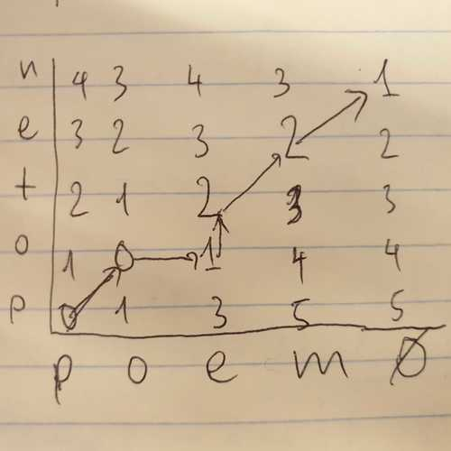
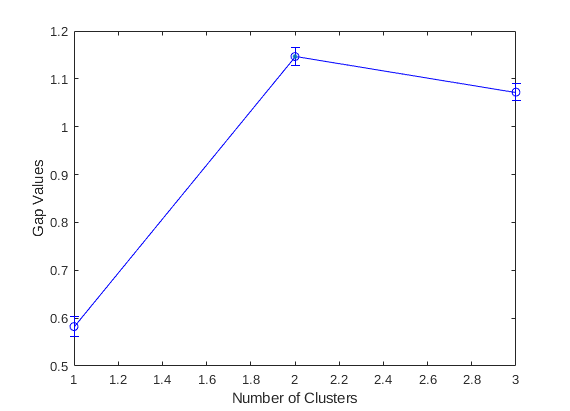
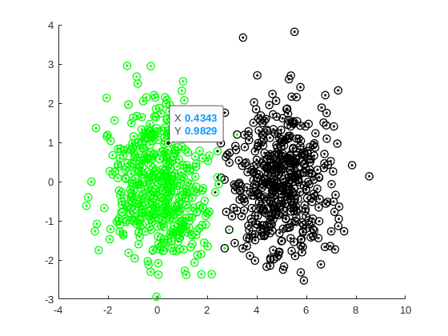
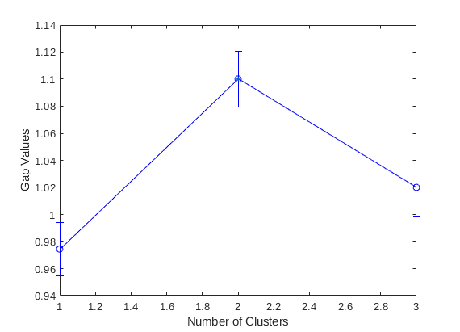
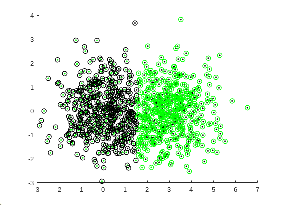
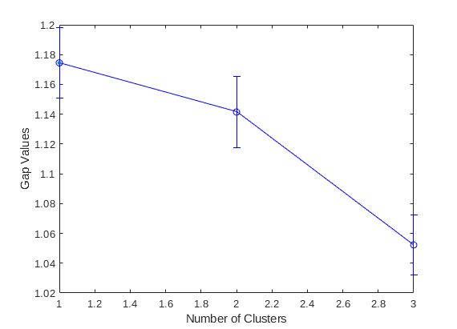
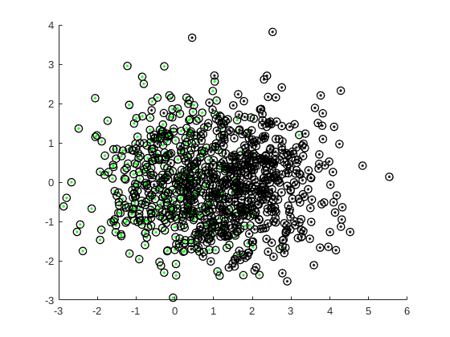
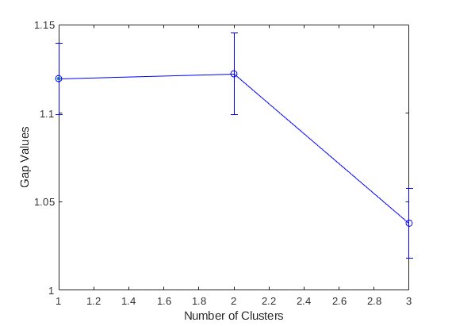
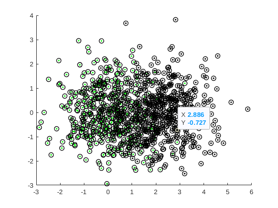

## Tai Duc Nguyen - ECEC 487 - 11/15/2019

## Homework 8

- [Written Homework](#written-homework)
  - [Problem 8.1 in Textbook Page 513](#problem-81-in-textbook-page-513)
  - [What are the two choices for reference distribution?](#what-are-the-two-choices-for-reference-distribution)
  - [How close can the two distributions get before the gap statistic fails to differentiate them?](#how-close-can-the-two-distributions-get-before-the-gap-statistic-fails-to-differentiate-them)
    - [Iteration 1: Mean1 = [0,0] Mean2 = [0,5]. N = 500. Unit variance](#iteration-1-mean1--00-mean2--05-n--500-unit-variance)
    - [Iteration 2: Mean1 = [0,0] Mean2 = [0,3]. N = 500. Unit variance](#iteration-2-mean1--00-mean2--03-n--500-unit-variance)
    - [Iteration 1: Mean1 = [0,0] Mean2 = [0,2]. N = 500. Unit variance](#iteration-1-mean1--00-mean2--02-n--500-unit-variance)
    - [Iteration 1: Mean1 = [0,0] Mean2 = [0,2.3]. N = 500. Unit variance](#iteration-1-mean1--00-mean2--023-n--500-unit-variance)
    - [Reference code](#reference-code)

# Written Homework

## Problem 8.1 in Textbook Page 513
*Find the Edit distance between the word “poem” and its misspelled version “poten.” Draw the optimal path.*

Cost of delete and insert = 1
Cost of subsitute = 2


***Reading**: R. Tibshirani, G. Walther, and T. Hastie, **"Estimating the number of clusters in a dataset via the gap statistic,"** Journal of the Royal Statistical Society, vol. 63, pp. 411 - 423, 2001.*

## What are the two choices for reference distribution?

Two choices for the reference distribution is:
- Uniform distribution in the range of the entire observed data set.
- Use PCA on the data. On each columns, and generate a uniform distribution over the range of such column.

## How close can the two distributions get before the gap statistic fails to differentiate them?

Using MATLAB's function `evalclusters`, the gap statistic plot is shown with each iteration below:

### Iteration 1: Mean1 = [0,0] Mean2 = [0,5]. N = 500. Unit variance
The gap statistic plot clearly shows that the optimum number of cluster is 2.




### Iteration 2: Mean1 = [0,0] Mean2 = [0,3]. N = 500. Unit variance
The gap statistic plot clearly shows that the optimum number of cluster is 2.




### Iteration 1: Mean1 = [0,0] Mean2 = [0,2]. N = 500. Unit variance
The gap statistic plot clearly shows that the optimum number of cluster is 1. Hence, the **gap statistic fail to differentiates the 2 clusters**




### Iteration 1: Mean1 = [0,0] Mean2 = [0,2.3]. N = 500. Unit variance
The gap statistic plot shows that the optimum number of cluster is 2 (very slightly), but the MATLAB's algorithm fail to distinguish the 2 clusters




### Reference code
```
%% Tai Duc Nguyen - ECEC 487 - 11/15/2019

clear all; close all;
seed = 0
randn('seed',seed);

%% How close can the two distributions get before the gap statistic fails to differentiate them?

M1 = [0 0];
M2 = [2.3 0];

S = [1 0; 0 1];
N = 500;

X1 = mvnrnd(M1, S, N);
X2 = mvnrnd(M2, S, N);

X = [X1;X2];
Y = [ones(N,1); ones(N,1)*2];

figure
scatter(X1(:,1), X1(:,2), 'g.');
hold on
scatter(X2(:,1), X2(:,2), 'k.');

E = evalclusters(X, 'kmeans', 'gap', 'KList', [1:3], 'Distance', 'sqEuclidean');

for i=1:size(X,1)
    if E.OptimalY(i) == 1
        plot(X(i,1), X(i,2), 'ko','MarkerSize',7, 'LineWidth', 1)
    else
        plot(X(i,1), X(i,2), 'go','MarkerSize',7, 'LineWidth', 1)
    end
end
hold off

figure
plot(E)
```
