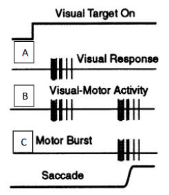
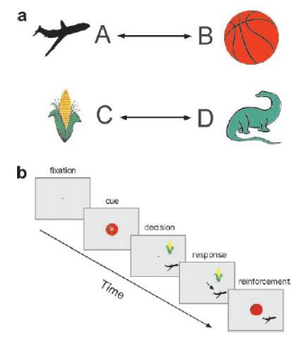
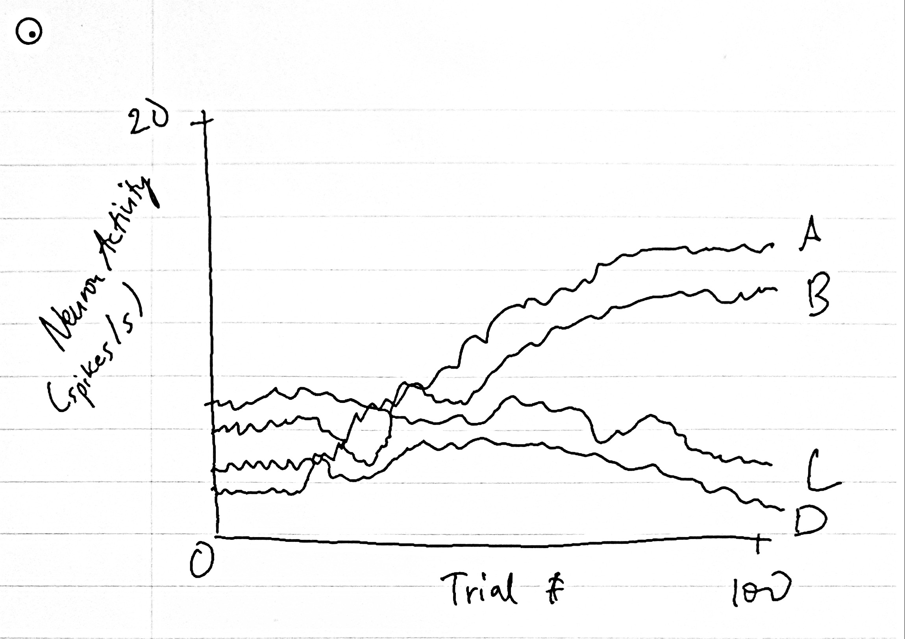
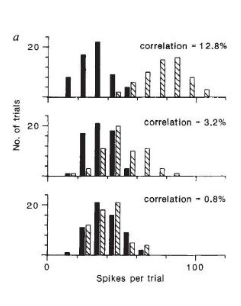
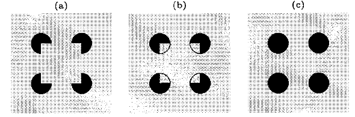
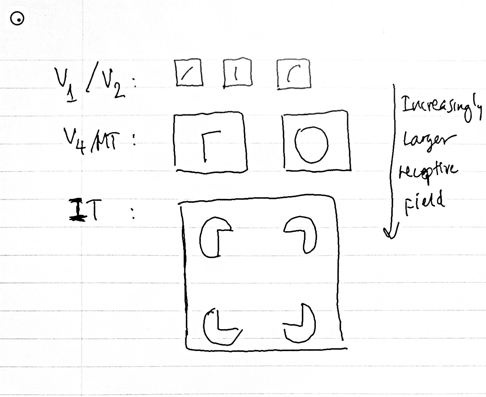

## Tai Duc Nguyen - BMES-T580 - 06/08/2020

# Final Exam

1. [Final Exam](#final-exam)
   1. [Problem 1](#problem-1)
      1. [Answer to part A](#answer-to-part-a)
      2. [Answer to part B](#answer-to-part-b)
      3. [Answer to part C](#answer-to-part-c)
      4. [Answer to part D](#answer-to-part-d)
   2. [Problem 2](#problem-2)
      1. [Answer to part A](#answer-to-part-a-1)
      2. [Answer to part B](#answer-to-part-b-1)
      3. [Answer to part C](#answer-to-part-c-1)
   3. [Problem 3](#problem-3)
      1. [Answer to part A](#answer-to-part-a-2)
      2. [Answer to part B](#answer-to-part-b-2)
      3. [Answer to part C](#answer-to-part-c-2)
      4. [Answer to part D](#answer-to-part-d-1)
      5. [Answer to part E](#answer-to-part-e)
   4. [Problem 4](#problem-4)
      1. [Answer to part A](#answer-to-part-a-3)
      2. [Answer to part B](#answer-to-part-b-3)
      3. [Answer to part C](#answer-to-part-c-3)
      4. [Answer to part D](#answer-to-part-d-2)

## Problem 1

The traces are schematic responses of different cell-types (A, B, C) in a single brain region. Answer the following questions:

A. Which brain regionis represented in these recordings? Explain the rationale for your answer

B. What are the inputs and outputs from this brain region?

C. How might the cell-types A, B, C be connected to each other? What experiment(one) would you do to confirm your hypothesis?

D. What are the defining characteristics of the cell-type C? That is what properties of saccades are encoded in those cells.

### Answer to part A

The brain region described by the figure above is the Superior Colliculus (SC) because:
1. SC is the region in which high level commands are delegated for eye movements.
2. SC receives input from the eye, many centers from the brain and integrates other sensory inputs to decide the direction of saccade.

### Answer to part B

The inputs of SC is visual information from the eye and many other sensory inputs from other parts of the brain. The outputs of SC are high-level commands to other motor neurons so as to control the eye movements

### Answer to part C

The cell A reeeives visual response from the primary visual cortex, passing its output to cell B, which form the association between the visual clue (cell A) to a motor activity. And the output of cell B is fed into cell C, where it outputs bursty signals to downstream motor neurons for movement control.

An experiment that could verify this hypothesis is:

An array of LEDs can be formed on a screen. A monkey's gaze is fixated on one LED in the middle of the screen. After some delay, the fixated LED is turned off and a second LED (target) is turned on. If the monkey can move its eye towards the target in a short amount of time (i.e. 500ms), then it is rewarded. After training the monkey, then cell type B will display an association between the visual cue (target) and motor activity (moving the eye towards that target).

### Answer to part D

Cell-type C output bursty signals. The level of the burst determines how far the eye moves.

## Problem 2

This is a paired association test. Answer the following questions:

A. What does this test examine? Describe the logic behind the experiment.

B. Neurons in which region of the brain are learning the association. Diagram the change in response of neurons in this region as the monkey learns the association.

C. Describe the circuit model underlying this association.

### Answer to part A

This test examine the ability of the subject to associate 2 objects. The logic behind the experiment is that:
1. The subject is tested for the ability for association. In this case, 2 objects (A and B). 
2. A visual cue is presented on the screen (one of the 2 object - A).
3. After a delay, 2 objects are shown on the screen (one of the 2 is the associated object - B).
4. The subject has to choose the one that is associated with the visual cue (A)
5. The subject is reinforced of the relationship (A and B)

### Answer to part B

Neurons in the IT region are learning the association. 

### Answer to part C

The neural circuit model underlies association is:

1. The object is processed through the low and intermediate-level visual processing region (V1-MT)
2. The processed information is fed into the IT, along with memory in the Medial Temporal Lobe, so as to form the association between 2 objects. This association is also sent to the Prefrontal Cortex (working memory)
3. Then, the working memory of the association in the PC are recalled whenever one of the 2 objects are shown.

## Problem 3

The figure on the left shows the result of an experiment performed to assess the role of single neurons in motion perception in primates. Solid bar = responses in null direction. Hashed bar = responses in preferred direction. Correlation refers to correlation between movement of random dots. Answer the following questions:

A. What region in the brain would you record from to find neurons that drive motion perception?

B. Describe the experimental procedure being employed here? That is how do researchers assess whether a given neuron is important for motion perception?

C. If the monkey is indeed making perceptual decisions based on this single neuron, what would its behavioral response look like? What analysis would you do to compare neural response to behavioral response?

D. If the behavioral response is better than what you would predict from this neuron, what is the most likely reason?

E. What experiment would you do to show that this region in the brain is important for behavior response to motion?

### Answer to part A

The region of the brain where neurons drive motion perception is the Middle Temporal (MT) visual area.

### Answer to part B

The experimental procedure employed may be similar to:

1. A number of dots is plotted randomly on a screen. A subject is shown this screen.
2. After a delay period, the screen is clear and the same set of dots is display, only now, each dot is either: 1) moved by a spatial offset in a direction, or 2) moved by a spatial offset in a random direction.
3. 0% correlation means all dots in the set are moved randomly
4. 50% correlation means that half of the dots are moved in one direction and the other half moved randomly
5. 100% correlation means all dots are moved in the same direction

If a neuron is important for motion perception, then its response to the low correlation should be the same since the dots move randomly for both NULL and PREFERRED directions. And vice versa, the neuron should response differently for the NULL vs. PREFERRED direction in the case of high correlation. 

### Answer to part C

If the monkey is supposed to make preception decisions, then its behavior may look like: It is likely to hold down a button when it sees high correlation and release the button when it doesn't see correlation.

A neuron in the Prefrontal Cortex can be measured for its perceptual decision making ability. Its activity should have a relationship to that of the neuron in MT.

### Answer to part D

It is for certain that the perceptual decision making ability in PC requires input from many neurons. Hence, if the behavioral response is better, then it probably means that he population coding of many MT neurons resulted in a response that is more clear to the PC.

### Answer to part E

An experiment could be devised such that a normal subject's performance is compared with one that has defects in the prefrontal cortex. If the performance is decreased, then it proves that PC plays a role in behavior response to motion.

## Problem 4

The figure is (a) represents a popular illusion. We observe a square where there B is none, i.e, an illusory square. Answer the following question:

A. Design an experiment using the three visual stimuli and single neuron recording to test whether a given neuron responds to illusory edges. Diagram the neural response to these stimuli consistent with the conclusion that the neuron does respond to illusory edges. Why do we need the stimuli in (b) and (c)?

B. It turns out neurons in V1 and V2 both respond to illusory squarein (a). Neurons in V2 respond (70 ms after stimulus onset in V2 versus 100 ms in V1) earlier than neurons in V1 to the same illusory edges. What does the fact that neurons in V1 respond later tell you about the mechanism underlying the responses to illusory square?

C. Describe the neural circuit underlying the response of V1 neuron to illusory square. Specifically, which circuits are involved and what are their roles?

D. One would expect each image processing area in the brain to be respond to some aspect of the illusory square. Diagram the receptive field of neurons in 3 different cortical regions associated with image processing.

### Answer to part A

An experiment could be devised such that:
1. A subject is shown a screen, where the subject has to fixate in the middle
2. The screen is then flashed with a stimulus.
3. After a delay period, the subject is asked whether if it sees the illusory square

We need the stimulus B because the circle edges should elicit a lower response than the stimulus A, but not 0. The stimulus C should elicit minimal response since there is no square detected by the subject.

### Answer to part B

The fact that neurons in V1 respond later means that there are some top-down inputs into V1; and these inputs allow V1 to do inference or edge completion along with extracting edge features. The illusionary square phenomenon is likely because: as the edge information reaches V2, which has a larger receptive field than V1, detects a familar represtation of a square (4 sharp vertex). V2 then send this information to V1, which then does inference (contour completion) to confirm V2's detection.

### Answer to part C

The neural circuitry underlies the response of V1 to a illusory square includes:
1. The primary visual cortex path way: V1<->V2<->...<->MT. This path way enables the subject to detect the edges, and do contour completion 
2. The inferior temporal gyrus allow the subject to actually see the square by collecting visual information and matching that to memory information. The information about there being a square is not only sent to V1, it is also sent upwards to MT and finally IT.

### Answer to part D

