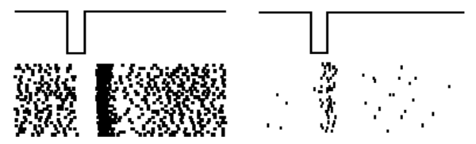
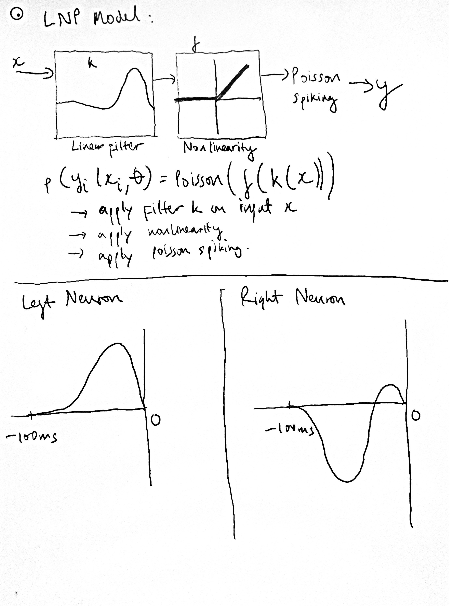
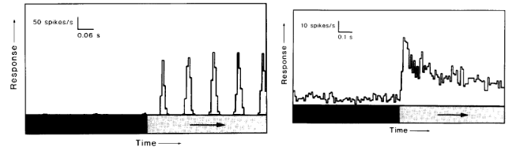
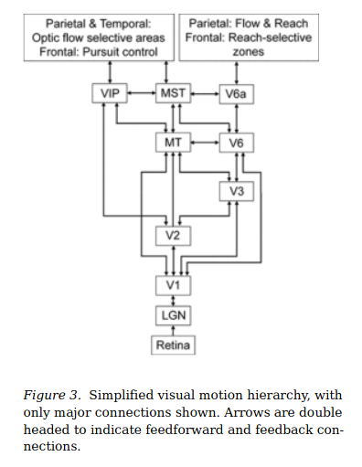
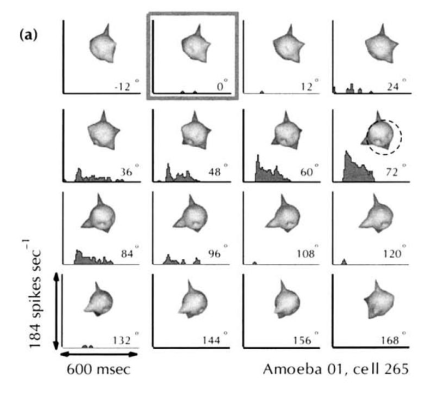

## Tai Duc Nguyen - BMES T580

# Midterm

1. [Midterm](#midterm)
   1. [Problem 1](#problem-1)
      1. [Answer to part A](#answer-to-part-a)
      2. [Answer to part B](#answer-to-part-b)
      3. [Answer to part C](#answer-to-part-c)
   2. [Problem 2](#problem-2)
      1. [Answer to part A](#answer-to-part-a-1)
      2. [Answer to part B](#answer-to-part-b-1)
      3. [Answer to part C](#answer-to-part-c-1)
   3. [Problem 3](#problem-3)
      1. [Answer to part A](#answer-to-part-a-2)
      2. [Answer to part B and C](#answer-to-part-b-and-c)
      3. [Answer to part D](#answer-to-part-d)

## Problem 1
The recordings below are of two neurons from the retina. A negative pulse of light is being
given (i.e., there is a short decrease in light lasting 100 milliseconds. Each row is a different trial and each tick is a spike. Answer the following questions:

A. What kind of neurons are these? Please explain your rationale

B. The responses of these neurons can be approximately described using the Linear-Nonlinear-
Poisson (LNP) model. Briefly describe the LNP model (a diagram with brief explanation should
be enough). Plot the linear filter for the two neurons and explain your answer.

C. Draw/Describe the receptive field for both these neurons.

### Answer to part A

These are retinal bipolar cells. The one on the left is a ON-bipolar cell, and the one on the right is a OFF-bipolar cell. It is apparent that:
1. The left neuron has lots of spikes when there is light and almost 0 spike when there is no light.
2. The right neuron has almost no spikes when there is light and many spikes when there is no light.

### Answer to part B

The linear filter for the neuron on the left is just a positive lobe because if there is no light, the input signal is near 0, producing no response

The linear filter for the neuron on the right is a large negative lobe accompanied by a smaller positive lobe because if there is light, then the response will be negative (which is 0 after applying non-linearity), and if there is little light, then the response will be small-positive.

### Answer to part C

Since the neuron on the left is active when the light is on, it is a ON-center bipolar cell. And, for similar reason, the neuron on the right is a OFF-center bipolar cell.

## Problem 2
The recordings below are from two different direction-selective neurons in the same brain
region. When the black bar underneath the response ends, a drifting grating moves resulting in
the response that is plotted. Answer the following questions:

A. Where in the brain would you find these two neurons? Please explain

B. Trace out the feedforward circuit from photoreceptors to medio temporal (MT) cortex. That
is, name the major cell-types and how they are connected to each other. Within that circuit, place these two neurons.

C. Explain how you can obtain one of the response-type shown above by connecting several
neurons that have the other response-type.

### Answer to part A

These 2 neurons are found in the primary visual cortex region of the brain because:
1. The left neuron has oscillating response to a moving grating, which means it combines responses from neurons in the retina for direction-selectivity
2. The right neuron has a positive, but varying response to a moving grating, which means it likely combine responses from presynaptic neurons that has an oscillating response. 

### Answer to part B
*Motion Processing in Primates by Tyler S. Manning and Kenneth H. Britten DOI:10.1093/acrefore/9780190264086.013.76*

From the figure above and information about the 2 neurons in the problem statement, the neuron on the left is a simple cell in V1, and the neuron on the right is a complex cell also in V1. Many direction-selective simple cells is connected to a complex cell.

### Answer to part C

Since the complex cell (right), is not phase modulated and the simple cell (left) is, in order to produce the response seen in the problem statement, the responses of many simple cells can be squared, slightly shifted, and added together to produce the response of a complex cell.

## Problem 3
The figure below describes the responses of a cortical neuron to visual stimuli. Each panel
shows the object being shown and the corresponding response. You should be able to guess the
significance of the angle in each panel by simply looking at the images. Answer the following questions:

A. What experiment is being conducted here? That is, what hypothesis is being tested by showing these different images

B. What kind of neuron is this? Which region of the brain is being recorded here?

C. Trace the pathway from lateral geniculate (LGN) to the brain region this neuron is being recorded from?

D. Name one visual feature/characteristic of the visual world this neuron is very unlikely to
respond to. Explain your rationale.

### Answer to part A

From the figure shown above, it looks like the researcher is rotating some round object with a big and a small indentation (which light is shined upon) in the horizontal direction from -12 to 168 degrees (180 degrees -- front to back), and measure a neuron's response to different angles. In addition, from the experiment's result, the strength of the neuronal response increases from $\theta = -12\degree$ to $\theta = 72\degree$ (peak), then decreases from $\theta = 72\degree$ to $\theta = 168\degree$. This can show that: this neuron is selective to the indentation on the round object. At the angle where the indentation is shown the clearest, the response peaks, and at otherwise, the response is minimal. 

### Answer to part B and C

Since this neuron is sensitive to a particular orientation, it is likely a hypercomplex cell in layer 4 of the primary visual cortex (a.k.a V6 or MT)

*Motion Processing in Primates by Tyler S. Manning and Kenneth H. Britten DOI:10.1093/acrefore/9780190264086.013.76*

### Answer to part D

Since this neuron is selective for orientation, it would probably not selective for direction of motions. For example, the neuron would spike for a particular angle of a rotating bar but its response will be the same for the bar rotating in the opposite direction.