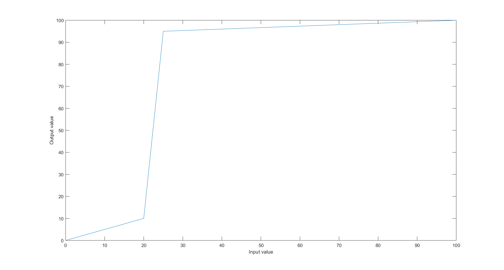
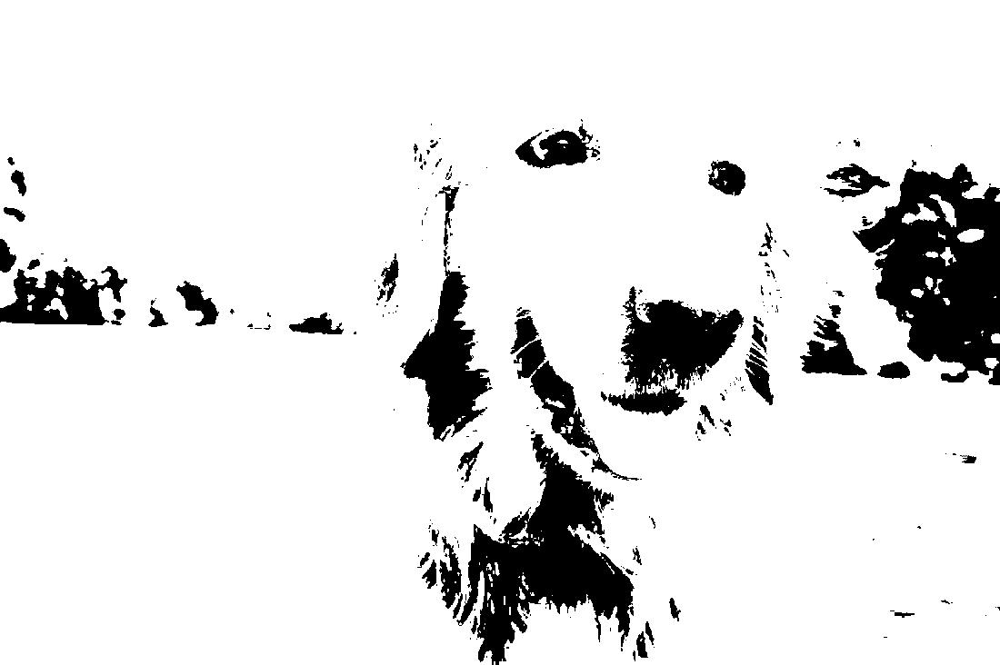
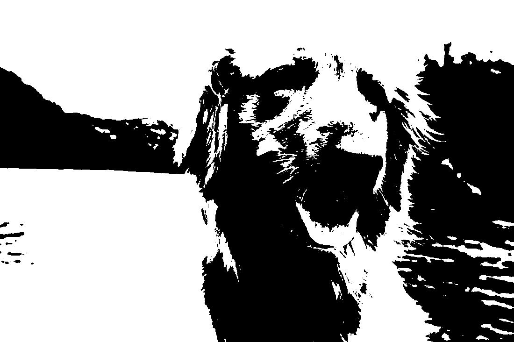
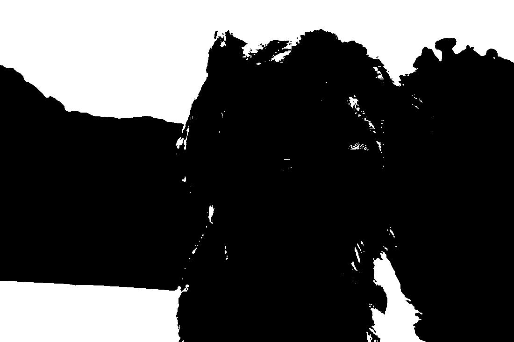

## Tai Duc Nguyen - CS 435 - 04/10/2019

- [Assignment 1 Theory](#assignment-1-theory)
  - [Q1](#q1)
  - [Q2](#q2)
  - [Q3](#q3)
    - [3a.](#3a)
    - [3b.](#3b)
    - [3c.](#3c)
- [Assignment 1 Programming](#assignment-1-programming)
  - [Original image](#original-image)
  - [Grayscaled image](#grayscaled-image)
  - [Binary images](#binary-images)
    - [25%](#25)
    - [50%](#50)
    - [75%](#75)
  - [Histograms](#histograms)
  - [Contrast stretching](#contrast-stretching)

# Assignment 1 Theory
## Q1
Given a point in 3D space, (3,5,20) and an effective focal length of 10, where will this point appear on the 2D image plane?

*Answer:*

(x,y,z) = (3,5,20)
f = 10
Hence, the (x,y) coordinate on the 2D image plane is:
$$(x_{2D}, y_{2D}) = \frac{f}{z_{3D}}(x_{3D}, y_{3D})$$
$$(x_{2D}, y_{2D}) = \frac{10}{20}(3, 5) = (1.5,2.5)$$
## Q2
If we have a focal length of 10 and a lens effective diameter of 5, what is the field of view of this camera system (in degrees)?

*Answer:*

Since:
$$tan{\frac{\theta}{2}} = \frac{D}{2f}$$
Hence:
$$tan{\frac{\theta}{2}} = \frac{5}{2*10} = \frac{1}{4}$$
$$\frac{\theta}{2} = tan^{-1}(\frac{1}{4}) = 14.036\degree$$
$$\theta = 2*14.036 = 28.072\degree$$

## Q3
Based on observing a histogram perhaps we decided to create the following pixel intensity mappings in order to stretch the values of a particularly compressed area:
> [0,20] $\rarr$ [0,10]
> 
> (20,25] $\rarr$ (10,95]
> 
> (25,100) $\rarr$ (95,100]

### 3a.
Draw a 2D graph showing these mappings. The x-axis will be the input values and the y-axis will be the output values. 

*Answer:*

### 3b. 
What are the equations for these mappings?

*Answer:*

Let us establish:
> $r1 = 0; s1 = 0;$
> $r2 = 20; s2 = 10;$
> $r3 = 25; s3 = 95;$
> $r4 = 100; s4 = 100;$

Hence, we have the following mappings:
$$r_{new} = \begin{cases} 
    (r-r1)*\frac{s2-s1}{r2-r1} + s1, r\in[r1, r2] \\
    (r-r2)*\frac{s3-s2}{r3-r2} + s2, r\in(r2, r3] \\
    (r-r3)*\frac{s4-s3}{r4-r3} + s3, r\in(r3, r4) \\
\end{cases}$$

### 3c.
Given a value of 50, what will this value be mapped to?

*Answer:*

Since 50 is between 25 and 100,
$$r_{new} = (r-r3)*\frac{s4-s3}{r4-r3} + s3$$
$$r_{new} = (50-25)*\frac{100-95}{100-25} + 95 = 25*\frac{5}{75}+95$$
$$r_{new} = \frac{5}{3} + 95 = 96.67$$

# Assignment 1 Programming
## Original image

## Grayscaled image

## Binary images
### 25%

### 50%

### 75%

## Histograms
.png)

## Contrast stretching
Looking at the distribution of pixel values in the dimmed image, there are potentially 4 peaks, which situated in between:
[0, 68], (68, 100], (100, 123], (123, 129]. Since the image is dark, we apply contrast stretching so that the image appear lighter and less blurry
> [0, 68] $\rarr$ [0,100]
> 
> (68, 100] $\rarr$ (100,160]
> 
> (100, 123) $\rarr$ (160, 200]
> 
> (123, 129] $\rarr$ (200, 255]

