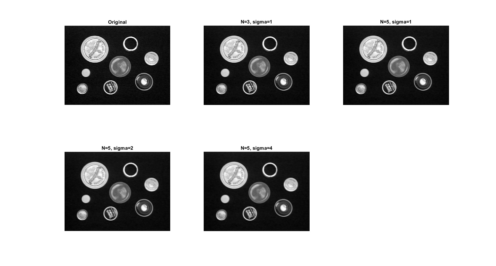
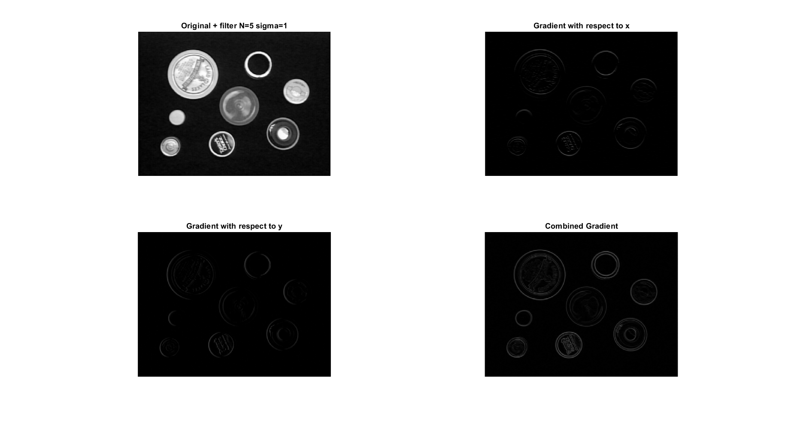
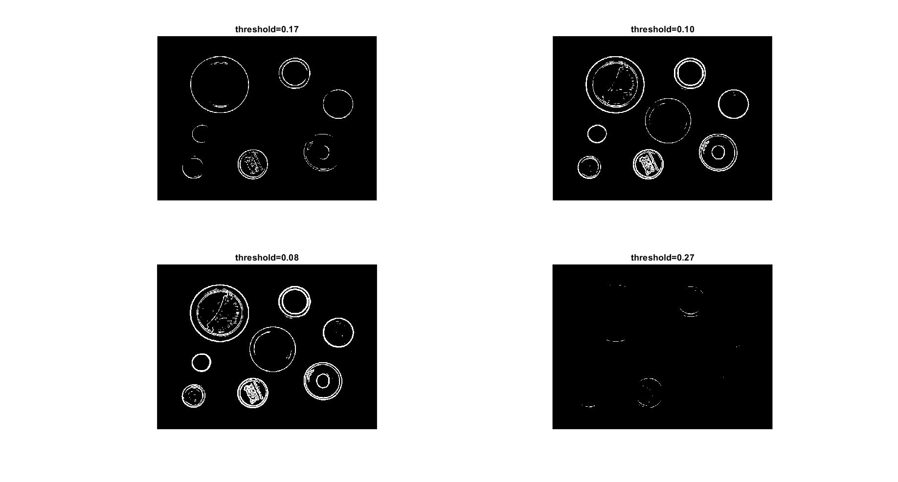
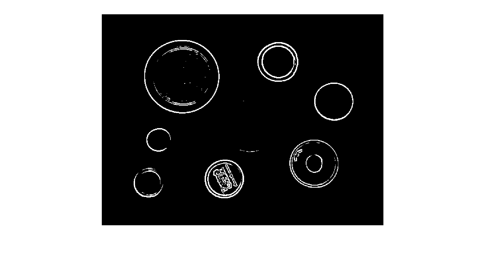
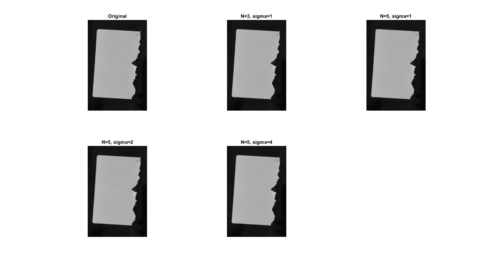
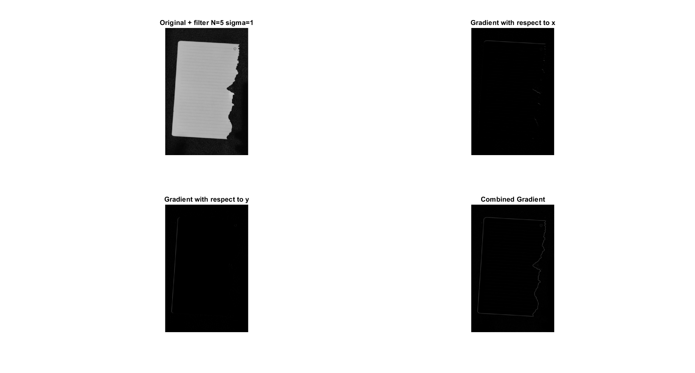
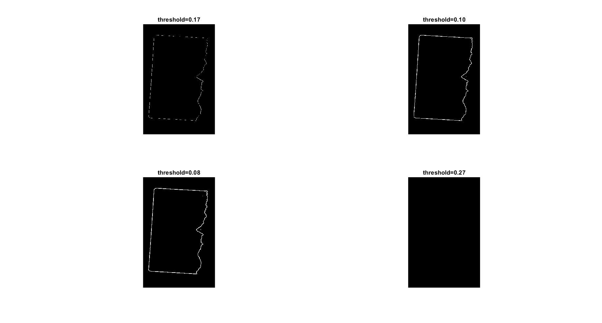
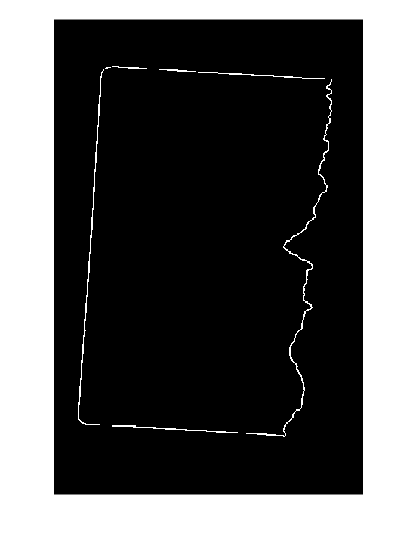

Tai Duc Nguyen - CS 435 - 04/18/2019

# Assignment 2 Theory

## Q1
Apply a 3 x 3 mean filter to the following 2D matrix. You may assume that the filter is only applied to areas of the data that have a full 9 samples to process.

*Answer:*

$I =\left[\begin{matrix} 
7 & 7 & 6 & 3 & 3 & 4 & 2 & 2 \\
3 & 7 & 2 & 6 & 4 & 4 & 5 & 7 \\
5 & 4 & 7 & 5 & 1 & 1 & 2 & 2 \\
2 & 1 & 3 & 4 & 1 & 3 & 5 & 6 \\
6 & 2 & 2 & 7 & 4 & 2 & 5 & 4 \\
2 & 2 & 2 & 3 & 6 & 6 & 6 & 7 \\
4 & 6 & 5 & 6 & 7 & 3 & 4 & 1 \\
5 & 2 & 4 & 6 & 1 & 4 & 1 & 4 \\
\end{matrix}\right]$

Applying a 3 x 3 mean filter

$W =\left[\begin{matrix} 
1/9 & 1/9 & 1/9 \\ 
1/9 & 1/9 & 1/9 \\ 
1/9 & 1/9 & 1/9 \\ 
\end{matrix}\right]$

Will resulted in:

$I_{new} =\left[\begin{matrix} 
7 & 7 & 6 & 3 & 3 & 4 & 2 & 2 \\
3 & 5.3333 & 5.0370 & 4.4486 & 3.2721 & 2.8080 & 3.0898 & 7 \\
5 & 3.9300 & 4.3054 & 3.4515 & 2.6645 & 2.6483 & 3.7273 & 2 \\
2 & 3.2484 & 3.6595 & 3.5645 & 3.2587 & 3.4776 & 3.7615 & 6 \\
6 & 2.7675 & 3.2489 & 3.9702 & 3.9190 & 4.3797 & 5.0688 & 4 \\
2 & 3.6685 & 3.9617 & 4.6778 & 4.9941 & 4.9291 & 4.3753 & 7 \\
4 & 3.9589 & 4.3630 & 4.6663 & 4.4741 & 3.5303 & 3.7594 & 1 \\
5 & 2 & 4 & 6 & 1 & 4 & 1 & 4 \\
\end{matrix}\right]$

## Q2
What is the kernel function for a 5 x 5 Gaussian function with $\sigma$ = 1. Show the filter as is, and then discretize it so that all values are integers, that the minimum value is 1, then normalize it so that all its elements sum to 1.

*Answer:*

Since
$h(u, v) = \frac{1}{2\pi\sigma^2}e^{-\frac{u^2+v^2}{\sigma^2}}$

Hence $H[u,v]$ is:

$H[u,v] =\left[\begin{matrix}
0.00001 & 0.00107 & 0.00292 & 0.00107 & 0.00001 \\
0.00107 & 0.02151 & 0.05855 & 0.02151 & 0.00107 \\
0.00292 & 0.05855 & 0.15915 & 0.05855 & 0.00292 \\
0.00107 & 0.02151 & 0.05855 & 0.02151 & 0.00107 \\
0.00001 & 0.00107 & 0.00292 & 0.00107 & 0.00001 \\
\end{matrix}\right]$

After discretization and normalization:

$H[u,v] =\left[\begin{matrix}
1 & 107 & 292 & 107 & 1 \\
107 & 2151 & 5855 & 2151 & 107 \\
292 & 5855 & 15915 & 5855 & 292 \\
107 & 2151 & 5855 & 2151 & 107 \\
1 & 107 & 292 & 107 & 1 \\
\end{matrix}\right]$

## Q3
What is the derivative of a 3 x 3 mean kernel with respect to x and y

*Answer:*

$W(x, y) =\left[\begin{matrix} 
1/9 & 1/9 & 1/9 \\ 
1/9 & 1/9 & 1/9 \\ 
1/9 & 1/9 & 1/9 \\ 
\end{matrix}\right]$

$\frac{\delta}{\delta x}=\left[\begin{matrix} 
-\frac{1}{3} & 0 & \frac{1}{3} \\ 
-\frac{1}{3} & 0 & \frac{1}{3} \\ 
-\frac{1}{3} & 0 & \frac{1}{3} \\ 
\end{matrix}\right]$

$\frac{\delta}{\delta y}=\left[\begin{matrix} 
-\frac{1}{3} & -\frac{1}{3} & -\frac{1}{3} \\ 
0 & 0 & 0 \\ 
\frac{1}{3} & \frac{1}{3} & \frac{1}{3} \\ 
\end{matrix}\right]$

Hence,

$\frac{d W}{d x}=\left[\begin{matrix} 
-\frac{1}{27} & 0 & \frac{1}{27} \\ 
-\frac{1}{27} & 0 & \frac{1}{27} \\ 
-\frac{1}{27} & 0 & \frac{1}{27} \\ 
\end{matrix}\right]$

and

$\frac{d W}{d y}=\left[\begin{matrix} 
-\frac{1}{27} & -\frac{1}{27} & -\frac{1}{27} \\ 
0 & 0 & 0 \\ 
\frac{1}{27} & \frac{1}{27} & \frac{1}{27} \\ 
\end{matrix}\right]$

## Q4
Given the following 2D kernels, what is the magnitude and direction of the gradient at the center pixel in 𝐼? 

$\frac{\delta}{\delta x}=\left[\begin{matrix} 
-\frac{1}{3} & 0 & \frac{1}{3} \\ 
-\frac{1}{3} & 0 & \frac{1}{3} \\ 
-\frac{1}{3} & 0 & \frac{1}{3} \\ 
\end{matrix}\right]$

$\frac{\delta}{\delta y}=\left[\begin{matrix} 
-\frac{1}{3} & -\frac{1}{3} & -\frac{1}{3} \\ 
0 & 0 & 0 \\ 
\frac{1}{3} & \frac{1}{3} & \frac{1}{3} \\ 
\end{matrix}\right]$

$I(x, y) =\left[\begin{matrix} 
7 & 7 & 6 \\ 
3 & 7 & 2 \\ 
5 & 4 & 7 \\ 
\end{matrix}\right]$

*Answer:*

Applying the 2D kernels to I, we have:

$\frac{\delta}{\delta x}I(x, y) =\left[\begin{matrix} 
-4.6667 & 0.6667 & 4.6667 \\
-6.0000 & -0.0000 & 6.0000 \\
-3.6667 & -0.3333 & 3.6667 \\
\end{matrix}\right]$

$\frac{\delta}{\delta y}I(x, y) =\left[\begin{matrix} 
-3.3333 & -4.0000 & -3.0000 \\
1.6667 & 1.3333 & 0.6667 \\
3.3333 & 4.0000 & 3.0000 \\
\end{matrix}\right]$

=> The magnitude of the center pixel is:

$\sqrt{\frac{\delta}{\delta x}I(0, 0)^2 + \frac{\delta}{\delta y}I(0, 0)^2} = \sqrt{0^2+1.3333^2} = 0.9428$

=> The direction of gradient is:

$\tan^{-1}{(\frac{\delta}{\delta x}I(0, 0) + \frac{\delta}{\delta y}I(0, 0))} = \tan^{-1}{(0+1.3333)} = 53.13\degree$

# Assignment 2 Programming

## *For provided image:*

## Part 1

## Part 2

## Part 3

## Part 4

## Part 5
## *For provided image:*

