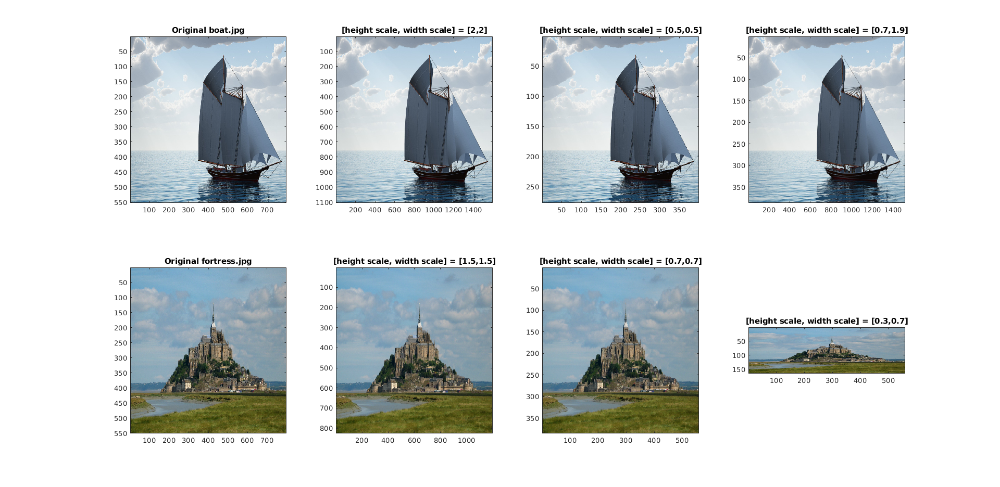
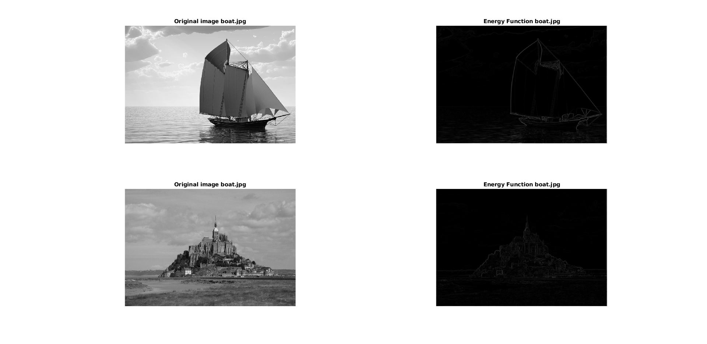
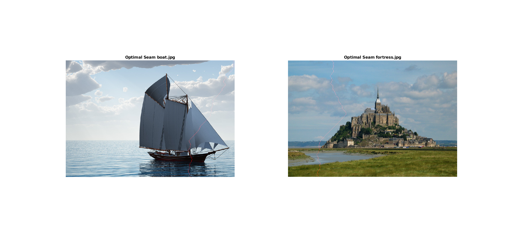

## Tai Duc Nguyen - CS 435 - HW3 - 05/04/19

<!-- @import "[TOC]" {cmd="toc" depthFrom=1 depthTo=6 orderedList=false} -->

<!-- code_chunk_output -->

	* [Tai Duc Nguyen - CS 435 - HW3 - 05/04/19](#tai-duc-nguyen-cs-435-hw3-050419)
- [Assignment 3 Theory](#assignment-3-theory)
  - [Q1](#q1)
    - [Q1a](#q1a)
    - [Q1b](#q1b)
    - [Q1c](#q1c)
    - [Q1d](#q1d)
  - [Q2](#q2)
    - [Q2a](#q2a)
    - [Q2b](#q2b)
- [Assignment 3 Theory](#assignment-3-theory-1)
  - [Part 1: Crop and Rescale](#part-1-crop-and-rescale)
  - [Part 2: Energy Function](#part-2-energy-function)
  - [Part 3: Optimal Seam](#part-3-optimal-seam)
  - [Part 4: Seam Carving](#part-4-seam-carving)

<!-- /code_chunk_output -->

# Assignment 3 Theory

## Q1
Below are two images, the one we’re copying to and the one we’re copying from.

$F =\left[\begin{matrix} 
    1 & 0 & 2 & 2 & 1 \\
    4 & 3 & 5 & 1 & 2 \\
    4 & 4 & 4 & 4 & 6 \\
    4 & 5 & 2 & 0 & 2 \\
    2 & 3 & 3 & 0 & 3 \\
    1 & 0 & 0 & 5 & 2 \\
\end{matrix}\right]$

$T =\left[\begin{matrix} 
    4 & 5 & 6 & 1 & 2 \\
    1 & 2 & 5 & 3 & 3 \\
    3 & 3 & 3 & 6 & 4 \\
    2 & 4 & 2 & 5 & 1 \\
    4 & 5 & 3 & 1 & 0 \\
    3 & 3 & 1 & 1 & 0 \\
\end{matrix}\right]$

### Q1a
Find the equation for J using the values found in the matrices above

*Answer:*

$J = \sum_{i=2}^{4}\sum_{j=2}^{4}I_{i,j}$

$J = I_{2,2} + I_{2,3} + I_{2,4} + I_{3,2} + I_{3,3} + I_{3,4} + I_{4,2} + I_{4,3} + I_{4,4}\\
= ((T_{2,2} - T_{1,2}) - (F_{2,2} - F_{1,2}))^2 + \\
((T_{2,3} - T_{1,3}) - (F_{2,3} - F_{1,3}))^2 + \\
((T_{2,4} - T_{1,4}) - (F_{2,4} - F_{1,4}))^2 + \\
((T_{3,2} - T_{2,2}) - (F_{3,2} - F_{2,2}))^2 + \\
((T_{3,3} - T_{2,3}) - (F_{3,3} - F_{2,3}))^2 + \\
((T_{3,4} - T_{2,4}) - (F_{3,4} - F_{2,4}))^2 + \\
((T_{4,2} - T_{3,2}) - (F_{4,2} - F_{3,2}))^2 + \\
((T_{4,3} - T_{3,3}) - (F_{4,3} - F_{3,3}))^2 + \\
((T_{4,4} - T_{3,4}) - (F_{4,4} - F_{3,4}))^2   \\
= 4 + 1 + 4 + 0 + 0 + 9 + 9 + 1 + 25 = 53$

### Q1b
Next compute the partial derivative of this cost function with regards to our knowns

*Answer:*

$T_{2,2} = a; T_{2,3} = b; T_{3,2} = c; T_{3,3} = d$

$J = ((a - 1) + 1)^2 + \\
((b - 3) - 0)^2 + 1 + \\
((c - a) - 2)^2 + \\
((d - b) - 0)^2 + 9 + \\
((3 - c) + 4)^2 + \\
((6 - d) - 0)^2 + 25 \\
=2a^2 + 4a + 2b^2 - 6b + 2c^2 -18c + 2d^2 - 12d - 2ac - 2db + C$

$\frac{\delta J}{\delta a} = 4a + 4 - 2c$

$\frac{\delta J}{\delta b} = 4b - 6 - 2d$

$\frac{\delta J}{\delta c} = 4c - 18 - 2a$

$\frac{\delta J}{\delta d} = 4d - 12 - 2b$

### Q1c
Finally, to minimize the partials, set them equal to zero and arrange in a matrix format such that Af = b

*Answer:*

$Af = b$

$A =\left[\begin{matrix} 
    4 & 0 & -2 & 0 \\ 
    0 & 4 & 0 & -2 \\ 
    -2 & 0 & 4 & 0 \\ 
    0 & -2 & 0 & 4 \\ 
\end{matrix}\right]$

$b =\left[\begin{matrix} 
    -4 \\
    6 \\
    18 \\
    12 \\ 
\end{matrix}\right]$

### Q1d
Solve for f using Matlab

*Answer:*

$f = A^{-1}*b$

$f =\left[\begin{matrix} 
    1.6667 \\
    4.0000 \\
    5.3333 \\
    5.0000 \\
\end{matrix}\right]$

## Q2
If the image below is the gradient of an image:

$A =\left[\begin{matrix} 
    2 & 3 & 4 & 5 & 1 \\ 
    1 & 0 & 2 & 2 & 1 \\ 
    4 & 3 & 5 & 1 & 2 \\ 
    4 & 4 & 4 & 4 & 6 \\ 
    4 & 5 & 2 & 0 & 2 \\
    2 & 3 & 3 & 0 & 3 \\
\end{matrix}\right]$

### Q2a
Construct the optimal seam matrix if we assume vertical seams

*Answer:*

$S =\left[\begin{matrix} 
    2 & 3 & 4 & 5 & 1 \\ 
    3 & 2 & 5 & 3 & 2 \\ 
    6 & 5 & 7 & 3 & 4 \\ 
    9 & 9 & 7 & 7 & 9 \\ 
    13 & 12 & 9 & 7 & 9 \\
    14 & 12 & 10 & 7 & 10 \\
\end{matrix}\right]$

### Q2b
What is the optimal seam?

*Answer:*

$S =\left[\begin{matrix} 
    2 & 3 & 4 & 5 & (1) \\ 
    3 & 2 & 5 & 3 & (2) \\ 
    6 & 5 & 7 & (3) & 4 \\ 
    9 & 9 & 7 & (7) & 9 \\ 
    13 & 12 & 9 & (7) & 9 \\
    14 & 12 & 10 & (7) & 10 \\
\end{matrix}\right]$

# Assignment 3 Theory

## Part 1: Crop and Rescale

Algorithm is written after Richard Alan Peters' II digital image processing slides on interpolation

https://ia902707.us.archive.org/23/items/Lectures_on_Image_Processing/EECE_4353_15_Resampling.pdf

## Part 2: Energy Function

NxN smoothing kernel N=5 sigma=1

## Part 3: Optimal Seam

## Part 4: Seam Carving
See video attached!
boat.avi
and
fortress.avi
