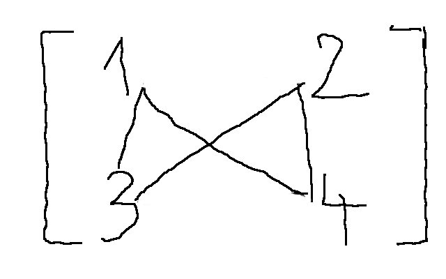
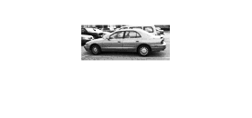
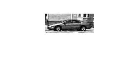
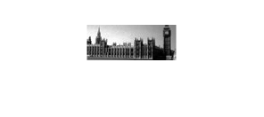
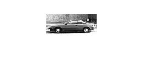
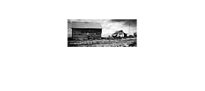
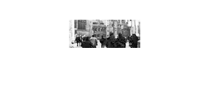
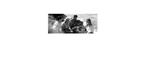

## Tai Duc Nguyen - CS 435 - HW3 - 05/04/19
- [Assignment 4 Theory](#assignment-4-theory)
  - [Q1](#q1)
    - [Q1a](#q1a)
    - [Q1b](#q1b)
- [Assignment 4 Programming](#assignment-4-programming)
  - [Program Output:](#program-output)
  - [Part 1: Classifying an Image using Grayscale Histograms](#part-1-classifying-an-image-using-grayscale-histograms)
    - [Success (these are cars):](#success-these-are-cars)
    - [Fail (both are recognized as cars):](#fail-both-are-recognized-as-cars)
  - [Part 2: Classifying an Image using Gists](#part-2-classifying-an-image-using-gists)
    - [Success (first on is car second one is not)](#success-first-on-is-car-second-one-is-not)
    - [Fail (both are recognized as cars)](#fail-both-are-recognized-as-cars)

# Assignment 4 Theory

## Q1
Given the following image:

$\left[\begin{matrix} 
    1 & 2 \\
    3 & 4 \\
\end{matrix}\right] = 
\left[\begin{matrix} 
    a & b \\
    c & d \\
\end{matrix}\right]$

### Q1a
Draw a fully connect graph representation of this image


Compute the similarity/weight between pixels:

$w(a, d) = e^{-((a_i-d_i)^2 + (a_x-d_x)^2 + (a_y-d_y)^2)} = e^{-(9 + 1 + 1)} = e^{-11}$
$w(a, c) = e^{-((a_i-c_i)^2 + (a_x-c_x)^2 + (a_y-c_y)^2)} = e^{-(4 + 0 + 1)} = e^{-5}$
$w(c, b) = e^{-((c_i-b_i)^2 + (c_x-b_x)^2 + (c_y-b_y)^2)} = e^{-(1 + 1 + 1)} = e^{-3}$
$w(b, d) = e^{-((b_i-d_i)^2 + (b_x-d_x)^2 + (b_y-d_y)^2)} = e^{-(4 + 0 + 1)} = e^{-5}$

$W = \left[\begin{matrix}
    w(a, d) & w(a, c) \\
    w(c, b) & w(b, d) \\
\end{matrix}\right] = 
\left[\begin{matrix}
    e^{-11} & e^{-5} \\
    e^{-3} & e^{-5} \\
\end{matrix}\right]$

### Q1b

Using matrix formulation, the equation is:

$|A \cup B|W^{-1}Dy = \lambda y$

$D = \left[\begin{matrix}
    w(a, d)+w(a, c) & w(c, b)+w(b, d) \\
    w(a, c)+w(c, b) & w(a, d)+w(b, d) \\
\end{matrix}\right] = 
\left[\begin{matrix}
    e^{-11}+e^{-5} & e^{-3}+e^{-5} \\
    e^{-5}+e^{-3} & e^{-11}+e^{-5} \\
\end{matrix}\right]$

$P = 4W^{-1}D = 
\left[\begin{matrix}
    4.0000 & -4.0000 \\
    4.0000 & 33.5661 \\
\end{matrix}\right]$

Since the trivial solution is where everything remains in one group, this eigenvector is associated with an eigenvalue of $|A \cup B|$

Eigenvalue of $|A \cup B| = 4$ is 4

The eigenvalues of $P$ is $\left[\begin{matrix}
    4.5514 \\
    33.0147 \\
\end{matrix}\right]$

Hence, we choose the eigenvector that has the eigenvalue of $4.5514$ to form the sub-groups = $\left[\begin{matrix}
    -0.9906 \\
    0.1366 \\
\end{matrix}\right]$

Hence, we cut the connection between a&d and c&b, forming 2 groups:
$a,c$ and $b,d$


# Assignment 4 Programming

## Program Output:
```
root_path =

    '/mnt/windows/Users/b3nnyth3d3g/Dropbox/MATLAB_workspace/CS435_HW4'


folder_path =

    '/mnt/windows/Users/b3nnyth3d3g/Dropbox/MATLAB_workspace/CS435_HW4/CarData/TrainImages/'


images_file =

    '/mnt/windows/Users/b3nnyth3d3g/Dropbox/MATLAB_workspace/CS435_HW4/images.dat'


seed =

     0

Classifying an Image using Grayscale Histograms
Accuracy: 0.578797

bin_num =

     8

Classifying an Image using Gist
Accuracy: 0.879656

```

## Part 1: Classifying an Image using Grayscale Histograms

### Success (these are cars):



### Fail (both are recognized as cars):



## Part 2: Classifying an Image using Gists

### Success (first on is car second one is not)



### Fail (both are recognized as cars)

