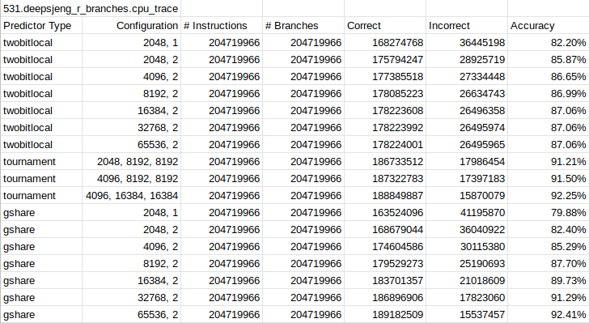
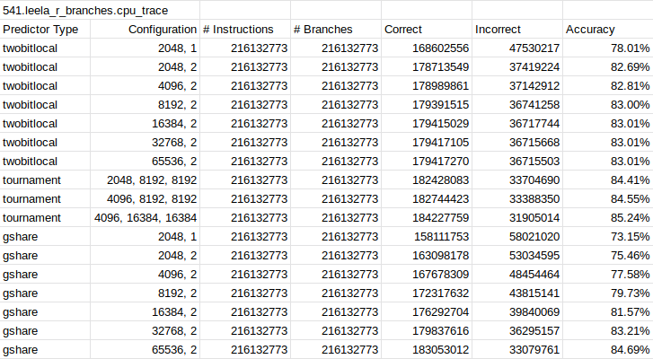
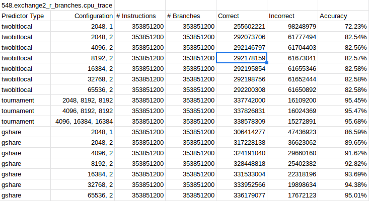
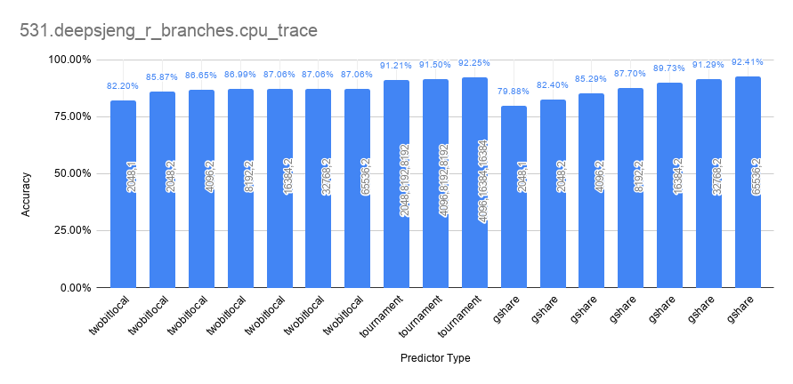
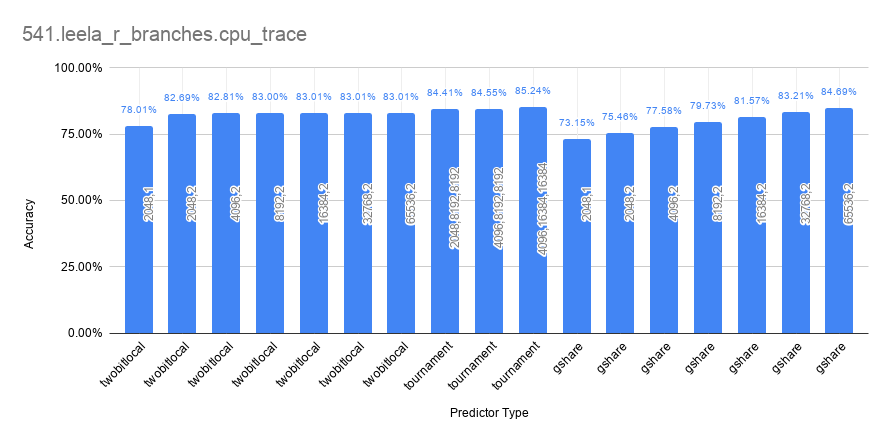
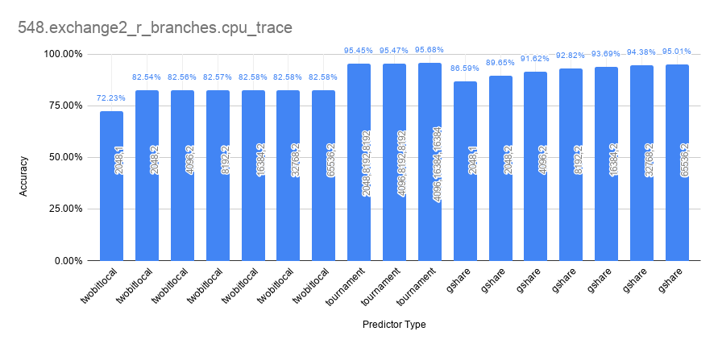
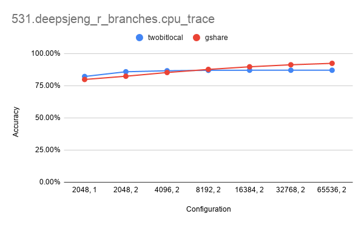
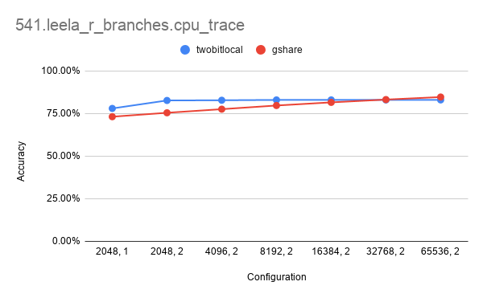
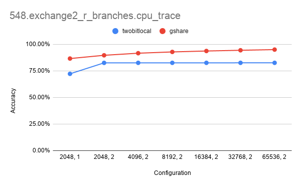

## Tai Duc Nguyen - ECEC412 - 10/01/2019


# Project 1

# TOC
- [Project 1](#project-1)
- [TOC](#toc)
- [Branch Predictor Evaluation](#branch-predictor-evaluation)
  - [Results from simulation](#results-from-simulation)
  - [Conclusions and Remarks](#conclusions-and-remarks)
    - [Two Bit Local (TBL) Predictor](#two-bit-local-tbl-predictor)
    - [Tournament (TNM) Predictor](#tournament-tnm-predictor)
    - [Gshare (GSR) Predictor](#gshare-gsr-predictor)

# Branch Predictor Evaluation

## Results from simulation

The performance of 3 predictors: Two Bit Local, Tournament and Gshare with 3 different sets of instructions are detailed in the tables and graphs below














## Conclusions and Remarks

### Two Bit Local (TBL) Predictor

The TBL predictor performs worst on average out of the 3 predictors in the simulation. The best configuration for this predictor is likely to be: `{localPredictorSize: 16384, localCounterBits: 2}`. Increasing the predictor size beyond this point does not increase the performance of the predictor. Hence, to save on hardware and memory used, 16384 is the best size according to the data.

### Tournament (TNM) Predictor

The TNM predictor performs very well, often on par with the Gshare predictor; sometimes, even surpasses it. The highest configuration `{localHistoryTableSize: 4096, globalPredictorSize: 16384, choicePredictorSize: 16384}` provides the best results in the simulation. It is likely that higher value for the `localHistoryTableSize` and the `globalPredictorSize` will give even better performance on more numerous set of instructions. With initial testing, the results for the 3 sets of instructions are:
```
541.leela_r_branches -> 65536, 65536, 65536 -> 86.426079%
531.deepsjeng_r_branches -> 65536, 65536, 65536 -> 93.387856%
548.exchange2_r_branches -> 65536, 65536, 65536 -> 95.802040%
```
The accuracy decreases for the 531 set but increases for the other 2 sets.

### Gshare (GSR) Predictor

The GSR predictor also performs very well, surpasses the TNM predictor in the `531.deepsjeng_r_branches` set of instructions, but loses to the TNM predictor in the other two sets by a small margin. The GSR predictor, however, has much better accuracy, by a large margin when compared to the TBL predictor. The best configurations for the GSR predictor is the highest one: `{globalPredictorSize: 65536, globalCounterBits: 2}`.
