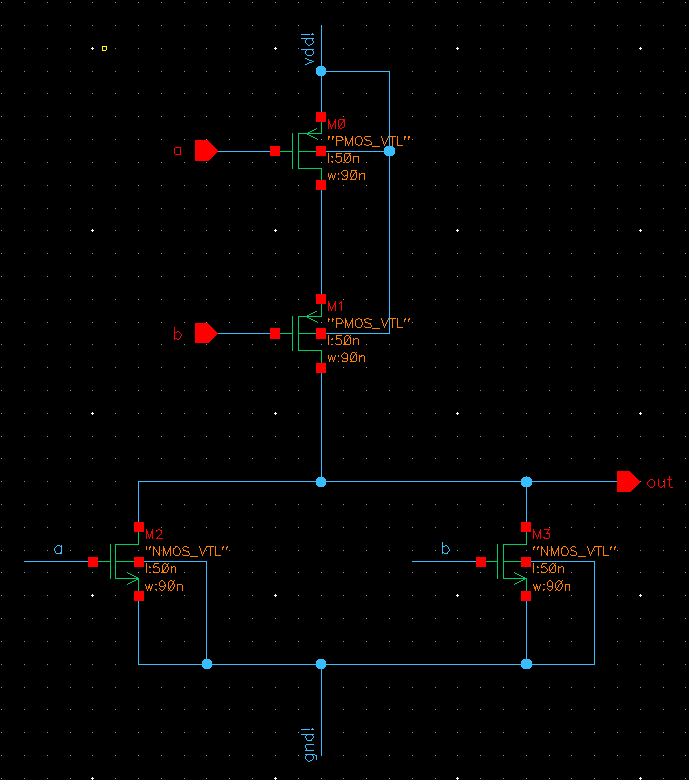

## Tai Duc Nguyen - ECEC471 - 10/20/2019

## Lab Report Week 3
## CMOS NOR & NAND

## Content
- [Objective](#objective)
- [Introduction](#introduction)
  - [Gate sizing](#gate-sizing)
  - [Rise time and Fall time](#rise-time-and-fall-time)
  - [Propagation delay](#propagation-delay)
  - [Symmetric gates](#symmetric-gates)
- [Simulation process and results](#simulation-process-and-results)
  - [Schematic design](#schematic-design)
  - [Layout design of symmetric inverter](#layout-design-of-symmetric-inverter)
  - [Physical verification](#physical-verification)
- [Analysis of simulation results](#analysis-of-simulation-results)
- [Conclusion](#conclusion)

# Objective
The objective for this laboratory is to design, simulate and verify the schematic and layout of a 2 input CMOS NOR & a 2 input CMOS NAND gate using Cadence Virtuoso. The process includes:
1. Creating the schematic with known sized PMOS & NMOS
2. Obtain a symmetric version of each gate with the ADE(L) simulation coupled with parametric analysis.
3. With the sizing decided for the NMOS & PMOS, the layout of each gate is built and checked against DRC and VLS verificaton tool.

# Introduction
NOR gate and NAND gate are `Universal` gates, which means that they are the building block of many, if not most, advanced electronics. Both gates require a pull up network consisting of 2 PMOS and a pull down network consisting of 2 NMOS. In a NOR gate, the 2 PMOS are connected in series and the 2 NMOS are connected in parallel. In a NAND gate, however, the reverse happens, where the PMOSes are in parallel and the NMOSes are in series.

## Gate sizing
The sizing of the PMOS and NMOS components in each gate have great impact to the performance of the gates. Hence, it is important to make both gate symmetric (equal rise time and fall time) to create a reponsive device. 

## Rise time and Fall time
The Rise time (denoted as $t_r$) is the time required for the output signal voltage to rise from 10% to 90%.

The Fall time (noted as $t_f$) is the time required for the output signal voltage to fall from 90% to 10%.

## Propagation delay
Propagation delay (denoted as $t_{pd}$) is the time from the moment the input voltage reaches 50% to the time the output voltage also reaches 50%.

## Symmetric gates
A gate is considered symmetric if and only if $t_r = t_f$. Hence, both the low to high and high to low transition will meet at $\frac{1}{2}$ VDD. In order to obtain this symmetricity, the sizing of the width of the NMOS and PMOS components can be adjusted.

# Simulation process and results

## Schematic design
The following figure (1a & 1b) show the initial set up for the schematic of the NOR gate (1a) and NAND gate (1b). All the lengths are 50nm and widths are 90nm.
{:height="36px" width="36px"} 

## Layout design of symmetric inverter

## Physical verification

# Analysis of simulation results

# Conclusion