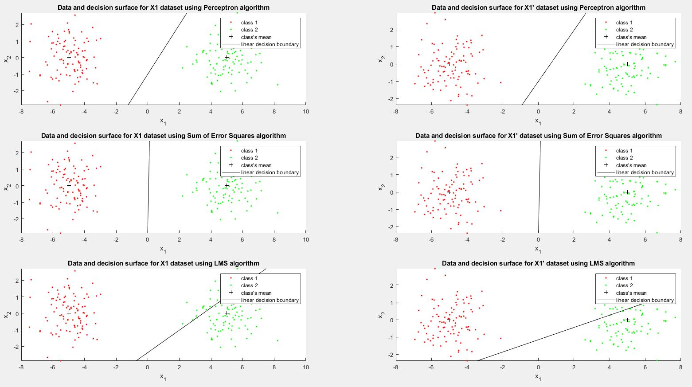
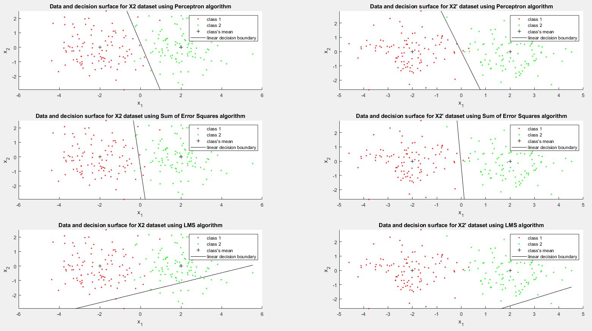

## Tai Duc Nguyen - ECEC487 - HW1 - 09/29/2019

## Contents
- [Computer Exercises (CX)](#computer-exercises-cx)
  - [HW CX 3.1](#hw-cx-31)
  - [HW CX 3.2](#hw-cx-32)
  - [Calculate performance of algorithm](#calculate-performance-of-algorithm)
  - [Using the data generation procedures from textbook CX 2.3 Page 80 with slight modifications](#using-the-data-generation-procedures-from-textbook-cx-23-page-80-with-slight-modifications)
  - [Using the data plotting procedures from textbook CX 2.4 Page 80 with slight modifications](#using-the-data-plotting-procedures-from-textbook-cx-24-page-80-with-slight-modifications)
  - [Using the Perception algorithm from textbook CX 3.1 Page 145 with slight modifications](#using-the-perception-algorithm-from-textbook-cx-31-page-145-with-slight-modifications)
  - [Using the Sum of Error Squares algorithm from textbook CX 3.2 Page 145 with slight modifications](#using-the-sum-of-error-squares-algorithm-from-textbook-cx-32-page-145-with-slight-modifications)
  - [Using the LMS algorithm from textbook CX 3.3 Page 146 with slight modifications](#using-the-lms-algorithm-from-textbook-cx-33-page-146-with-slight-modifications)
  - [Conclusion and remarks](#conclusion-and-remarks)
- [Written Homework](#written-homework)
  - [Question](#question)
  - [Answer](#answer)


# Computer Exercises (CX)

```
seed = 0
randn('seed',seed);
```
`seed =`

`    0`

## HW CX 3.1
```
clear; close all;

% Prepare the variables:
N = 200;

m1 = [-5;0];
m2 = [5;0];
m = [m1 m2];

S1 = eye(2)*1;
S2 = S1;
S(:,:,1) = S1; S(:,:,2) = S2;

P = [1/2;1/2];

% Generate data set X1, X1_ and class assignments y1, y1_
[X1, y1] = generate_gauss_classes(m, S, P, N);
[X1_, y1_] = generate_gauss_classes(m, S, P, N);

% Add an additional coordinate and set it equal to 1
X1(:,3) = ones(size(X1,1),1);
X1_(:,3) = ones(size(X1_,1),1);

X1 = X1';
X1_ = X1_';

[c,~]=size(X1);
w0 = ones(c,1);
y_temp1 = y1;
y_temp1(y_temp1==2) = -1;

y_temp1_ = y1_;
y_temp1_(y_temp1_==2) = -1;

r_plt = 3;
c_plt = 2;
figure()

% Train the data with the Perceptron algorithm to create a classifier
w1_per = perceptron_train(X1,y_temp1,w0);
plot_data(X1, y1, m, w1_per, "Data and decision surface for X1 dataset using Perceptron algorithm", r_plt, c_plt, 1);
perf = calculate_performance(X1,y_temp1,w1_per);
sprintf("X1 Perceptron: %f", perf)

w1_per_ = perceptron_train(X1_,y_temp1_,w0);
plot_data(X1_, y1_, m, w1_per_, "Data and decision surface for X1' dataset using Perceptron algorithm", r_plt, c_plt, 2);
perf = calculate_performance(X1_,y_temp1_,w1_per_);
sprintf("X1' Perceptron: %f", perf)

% Train the data with the Sum of Error Squares algorithm to create a classifier
w1_ses = SSErr_train(X1,y_temp1);
plot_data(X1, y1, m, w1_ses, "Data and decision surface for X1 dataset using Sum of Error Squares algorithm", r_plt, c_plt, 3);
perf = calculate_performance(X1,y_temp1,w1_ses);
sprintf("X1 Sum of Error Squares: %f", perf)

w1_ses_ = SSErr_train(X1_,y_temp1_);
plot_data(X1_, y1_, m, w1_ses, "Data and decision surface for X1' dataset using Sum of Error Squares algorithm", r_plt, c_plt, 4);
perf = calculate_performance(X1_,y_temp1_,w1_ses_);
sprintf("X1' Sum of Error Squares: %f", perf)

% Train the data with the LMS algorithm to create a classifier
w1_lms = LMSalg_train(X1,y_temp1,w0);
plot_data(X1, y1, m, w1_lms, "Data and decision surface for X1 dataset using LMS algorithm", r_plt, c_plt, 5);
perf = calculate_performance(X1,y_temp1,w1_lms);
sprintf("X1 LMS: %f", perf)

w1_lms_ = LMSalg_train(X1_,y_temp1_,w0);
plot_data(X1_, y1_, m, w1_lms_, "Data and decision surface for X1' dataset using LMS algorithm", r_plt, c_plt, 6);
perf = calculate_performance(X1_,y_temp1_,w1_lms_);
sprintf("X1' LMS: %f", perf)
```

## HW CX 3.2
```
% Prepare the variables:
N = 200;

m1 = [-2;0];
m2 = [2;0];
m = [m1 m2];

S1 = eye(2)*1;
S2 = S1;
S(:,:,1) = S1; S(:,:,2) = S2;

P = [1/2;1/2];

% Generate data set X2, X2_ and class assignments y2, y2_
[X2, y2] = generate_gauss_classes(m, S, P, N);
[X2_, y2_] = generate_gauss_classes(m, S, P, N);

% Add an additional coordinate and set it equal to 1
X2(:,3) = ones(size(X2,1),1);
X2_(:,3) = ones(size(X2_,1),1);

X2 = X2';
X2_ = X2_';

[c,~]=size(X2);
w0 = ones(c,1);
y_temp2 = y2;
y_temp2(y_temp2==2) = -1;

y_temp2_ = y2_;
y_temp2_(y_temp2_==2) = -1;

r_plt = 3;
c_plt = 2;
figure()

% Train the data with the Perceptron algorithm to create a classifier
w2_per = perceptron_train(X2,y_temp2,w0);
plot_data(X2, y2, m, w2_per, "Data and decision surface for X2 dataset using Perceptron algorithm", r_plt, c_plt, 1);
perf = calculate_performance(X2,y_temp2,w2_per);
sprintf("X2 Perceptron: %f", perf)

w2_per_ = perceptron_train(X2_,y_temp2_,w0);
plot_data(X2_, y2_, m, w2_per_, "Data and decision surface for X2' dataset using Perceptron algorithm", r_plt, c_plt, 2);
perf = calculate_performance(X2_,y_temp2_,w2_per_);
sprintf("X2' Perceptron: %f", perf)

% Train the data with the Sum of Error Squares algorithm to create a classifier
w2_ses = SSErr_train(X2,y_temp2);
plot_data(X2, y2, m, w2_ses, "Data and decision surface for X2 dataset using Sum of Error Squares algorithm", r_plt, c_plt, 3);
perf = calculate_performance(X2,y_temp2,w2_ses);
sprintf("X2 Sum of Error Squares: %f", perf)

w2_ses_ = SSErr_train(X2_,y_temp2_);
plot_data(X2_, y2_, m, w2_ses_, "Data and decision surface for X2' dataset using Sum of Error Squares algorithm", r_plt, c_plt, 4);
perf = calculate_performance(X2_,y_temp2_,w2_ses_);
sprintf("X2' Sum of Error Squares: %f", perf)

% Train the data with the LMS algorithm to create a classifier
w2_lms = LMSalg_train(X2,y_temp2,w0);
plot_data(X2, y2, m, w2_lms, "Data and decision surface for X2 dataset using LMS algorithm", r_plt, c_plt, 5);
perf = calculate_performance(X2,y_temp2,w2_lms);
sprintf("X2 LMS: %f", perf)

w2_lms_ = LMSalg_train(X2_,y_temp2_,w0);
plot_data(X2_, y2_, m, w2_lms_, "Data and decision surface for X2' dataset using LMS algorithm", r_plt, c_plt, 6);
perf = calculate_performance(X2_,y_temp2_,w2_lms_);
sprintf("X2' LMS: %f", perf)
```

## Calculate performance of algorithm
```
function P = calculate_performance(X,y,w)
    P = sum(w'*X.*y < 0);
end
```

## Using the data generation procedures from textbook CX 2.3 Page 80 with slight modifications
```
function [X,y] = generate_gauss_classes(m,S,P,N)
[~,c]=size(m);
X=[];
y=[];
    for j=1:c
        % Generating the [p(j)*N)] vectors from each distribution
        t=mvnrnd(m(:,j),S(:,:,j),fix(P(j)*N));
        % The total number of points may be slightly less than N
        % due to the fix operator
        X=[X; t];
        y=[y ones(1,fix(P(j)*N))*j];
    end
end
```

## Using the data plotting procedures from textbook CX 2.4 Page 80 with slight modifications
```
function plot_data(X,y,m,w,TLE,r_plt,c_plt,iplot)
    [l,c]=size(m); % c=no. of classes
    if(l ~= 2)
        fprintf('NO PLOT CAN BE GENERATED\n')
        return
    else
        pale=['r.'; 'g.'; 'b.'; 'y.'; 'm.'; 'c.'];
        subplot(r_plt,c_plt,iplot);
        % Plot of the data vectors
        hold on
        X1 = X(1,:);
        X2 = X(2,:);
        for j=1:c
            scatter(X1(y == j),X2(y == j),pale(j,:))
        end
        scatter(m(1,:),m(2,:),'k+')
    end

    decision_x = linspace(min(X1), max(X1));
    decision_y = -(w(1)/w(2))*decision_x - (w(3)/w(2));
    plot(decision_x, decision_y, "k");
    hold off
    title(TLE)
    xlabel("x_{1}")
    ylabel("x_{2}")
    ylim([min(X2) max(X2)])
    legend("class 1", "class 2", "class's mean", "linear decision boundary") 
end
```

## Using the Perception algorithm from textbook CX 3.1 Page 145 with slight modifications
```
function w = perceptron_train(X,y,w_ini)
    [l,N]=size(X);
    max_iter=10000; % Maximum allowable number of iterations
    rho=0.05; % Learning rate
    w=w_ini; % Initialization of the parameter vector
    iter=0; % Iteration counter
    mis_clas=N; % Number of misclassified vectors
    while (mis_clas>0) && (iter<max_iter)
        iter=iter+1;
        mis_clas=0;
        gradi=zeros(l,1);% Computation of the "gradient"
        % term
        for i=1:N
            if((X(:,i)'*w)*y(i)<0)
                mis_clas=mis_clas+1;
                gradi=gradi+rho*(-y(i)*X(:,i));
            end
        end
        w=w-rho*gradi; % Updating the parameter vector
    end
end
```

## Using the Sum of Error Squares algorithm from textbook CX 3.2 Page 145 with slight modifications
```
function w = SSErr_train(X,y)
    w = inv(X*X')*(X*y');
end
```

## Using the LMS algorithm from textbook CX 3.3 Page 146 with slight modifications
```
function w = LMSalg_train(X,y,w_ini)
    [~,N]=size(X);
    rho=0.1; % Learning rate initialization
    w=w_ini; % Initialization of the parameter vector
    for i=1:N
        w = w + (rho/i)*(y(i)-X(:,i)'*w)*X(:,i);
    end
end
```

## Conclusion and remarks

    The miss classifications due to different algorithms on different data sets are:
    "X1 Perceptron: 0.000000"
    "X1' Perceptron: 0.000000"
    "X1 Sum of Error Squares: 0.000000"
    "X1' Sum of Error Squares: 0.000000"
    "X1 LMS: 24.000000"
    "X1' LMS: 26.000000"
    "X2 Perceptron: 5.000000"
    "X2' Perceptron: 2.000000"
    "X2 Sum of Error Squares: 8.000000"
    "X2' Sum of Error Squares: 3.000000"
    "X2 LMS: 88.000000"
    "X2' LMS: 99.000000"




With $w_0 = [1; 1; 1]$, there are two remarks:

From the results of the experiment 1 (CX 3.1) ($m1 = [-5,0] \And m2=[5,0]$ and $S1=S2=I$), it is observed that the Perceptron and the Sum of Error Squares algorithm both achieve good accuracy due to the data being partitioned far apart. However, the LMS algorithm did not achieve good results.

In experiment 2 (CX 3.2), $m1 = [-2,0] \And m2=[2,0]$ and $S1=S2=I$, which makes the data points of both classes overlaps -- there is no clear boundaries separating the two classes. It is apparent that the performance of all 3 algorithms reduces. The Perceptron algorithm seems to achieve a little bit better result than the Sum of Error Squares algorithm. The LMS algorithm, again, did not achieve good results.

Changing the $w_0$ vector does not affect the Perceptron algorithm by a large margin. The Sum of Error Squares algorithm does not depend on $w_0$. However, the LMS algorithm can achieve better result for better values of $w_0$. Also, LMS algorithm depends largely on the step-size, which is supposed to change rather steep. A better configuration of the step-size variable can have considerable impact to the performance of this algorithm

From the remarks above, it is possible to conclude that for the data set generated, the Perceptron and the Sum of Error Square algorithms generate good classifiers, while the LMS algorithm needs a lot more tunning to achieve the same results.

# Written Homework

## Question
Explain why the perceptron cost function is a continuous piecewise linear function.

## Answer
To understand why the perceptron cost function (PCF) is a *continuous* and *piecewise linear* function, we need to revise the Perceptron Algorithm:
- Chose $w(0)$ and $\rho_0$ randomly (at $t=0$)
- While $Y$ is not $\emptyset$: (\*)
  - $Y$ = $\emptyset$
  - Classify training set using $w(t)$ and $\rho_t$. (\*\*)
  - Wrong classification will be added to set $Y$
  - Adjust $w(t+1)$
  - Adjust $\rho_t$
  - $t = t+1$
- End While


Assume that the algorithm works and coverges to a solution (a.k.a $Y=\emptyset$ after step (\*\*)), then, naturally, after each iteration of the outer loop (\*), the number of elements in set $Y$ will ideally reduce. Hence, while the the number of elements in set $Y$ stay the same, $J(\bold{w}) = \sum_{x\in y}(\delta_x \bold{w}^T \bold{x})$ is a **linear** function. However, when 
number of elements in set $Y$ changes, $\frac{\partial J(w)}{\partial w}\vert_{w=w(t)}$ is undefined and therefore, **discontinuous**. Hence, the perceptron cost function is a **continuous** **piecewise** **linear** function.