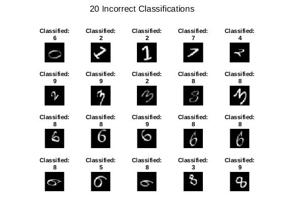
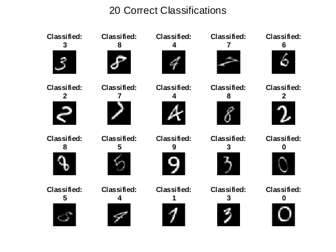

## Tai Duc Nguyen - ECEC 487 - 10/26/2019
- [Homework Part 0](#homework-part-0)
  - [a. What accuracy do you obtain?](#a-what-accuracy-do-you-obtain)
  - [Compare the accuracy of your solution with the example solution. If they differ, explain why. If they are the same, explain why](#compare-the-accuracy-of-your-solution-with-the-example-solution-if-they-differ-explain-why-if-they-are-the-same-explain-why)
  - [Show the digits at the beginning of the demo is an excellent visualization to confirm the inputs are correct. What would be a good visualization to validate the classification results?](#show-the-digits-at-the-beginning-of-the-demo-is-an-excellent-visualization-to-confirm-the-inputs-are-correct-what-would-be-a-good-visualization-to-validate-the-classification-results)
  - [Extra credit: implement your visualization suggestion](#extra-credit-implement-your-visualization-suggestion)
- [Homework Part 1 (Next Page)](#homework-part-1-next-page)

# Homework Part 0

## a. What accuracy do you obtain?
Attempt 1: 98.80%

Attempt 2: 98.96%

Attempt 3: 99.00%

Attempt 4: 98.72%

Attempt 5: 98.92%

## Compare the accuracy of your solution with the example solution. If they differ, explain why. If they are the same, explain why
The accuracies obtained from my solution is different from that of the example solution (98.72%). These small differences are due to the randomized initial weights and biases at each neuron. Although the sensitivity of the network can tolerate different initializations through the **Batch Normalization Layer**, the network's outputs are still subjected to its initial conditions. 

## Show the digits at the beginning of the demo is an excellent visualization to confirm the inputs are correct. What would be a good visualization to validate the classification results?
A good visualization to validate the classification results can be made from a collage of:

    - For each digits (0...10)
        - Wrong classifications and their original images
        - One correct classification and its original image

## Extra credit: implement your visualization suggestion

```
WrongPred = YPred ~= YValidation;
WrongPredCatg = YPred(WrongPred);

WrongImg = find(WrongPred == 1);

figure;
sgtitle('20 Incorrect Classifications')
for i = 1:20
    subplot(4,5,i);
    imshow(imdsValidation.Files{WrongImg(i)});
    title(['Classified: ', WrongPredCatg(i)])
end
```


```
CorrectPred = YPred == YValidation;
CorrectPredCatg = YPred(CorrectPred);
idx=randperm(length(CorrectPredCatg));

CorrectImg = find(CorrectPred == 1);

figure;
sgtitle('20 Correct Classifications')
for i = 1:20
    subplot(4,5,i);
    imshow(imdsValidation.Files{CorrectImg(idx(i))});
    title(['Classified: ', CorrectPredCatg(idx(i))])
end
```


# Homework Part 1 (Next Page)

